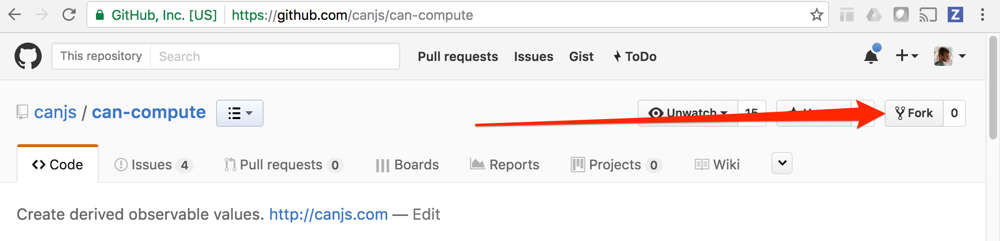

@page guides/contributing/code Code
@parent guides/contribute

@description Learn how contribute a code change to CanJS.

@body

## Overview

Contributing to any Open Source project can be intimidating.  All contributions from all types of contributors are welcome.  We’re
committed to making the experience as pleasant and rewarding as possible.  We’re happy to set up a
pairing session to show you how to fix a bug or write a feature.  

If you have any questions, you can always reach us on [Gitter chat](https://gitter.im/canjs/canjs).

The first thing to know about `CanJS` is that its code is split across about 40 different
repositories.  All but one of these are __library__ repositories like
[canjs/can-event](https://github.com/canjs/can-event) and [canjs/can-define](https://github.com/canjs/can-define).  These all work the same way.
The [canjs/canjs](https://github.com/canjs/canjs) __framework__ repository works slightly
differently.  The vast majority of code changes happen in one of the __library__
repositories.

If you don’t know which repository you need to work on, ask us in [Gitter chat](https://gitter.im/canjs/canjs).

We’ll cover the following details in this guide:

- Setting up your development environment.
- Getting the repository’s code and verify it’s working.
- The file organization and responsibilities.
- Making changes and submitting a pull request.

The following video walks through most of the following steps:

<iframe width="560" height="315" src="https://www.youtube.com/embed/PRuueWqnpIw" frameborder="0" allowfullscreen></iframe>

## Setting up your development environment

Developing CanJS requires:

 - A [GitHub](https://github.com/) account and git client.
 - Node.js version 5 or later.
 - Firefox for running automated tests.

### Getting GitHub account and client

Sign up for a [GitHub](https://github.com/) account.  

There are a variety of ways to get a git command line client
connected to your GitHub account. GitHub has
great documentation on how to [set up Git](https://help.github.com/articles/set-up-git/).


If you already have `git` installed, make sure you’ve
[set up your ssh keys](https://help.github.com/articles/adding-a-new-ssh-key-to-your-github-account/).

### Get Node.js

Download Node.js version 5 or later at [NodeJS.org](https://nodejs.org).  You can
verify Node’s version with:

```
node -v
```

### Get Firefox

Download the Firefox browser
[here](https://www.mozilla.org/en-US/firefox/new/). Make sure it gets installed into the
default location for your operating system.

Firefox is used to run each repository’s tests.


## Getting the code and verifying that it’s working

Once your environment is set up, you should be able to clone the repository you
want to change, install its dependencies, and verify you’ve set up your
development environment correctly.

__1.__  Click the __Fork__ button to fork the repository from which you will be working.
For example, you can fork `can-compute` by pressing its __Fork__ button on GitHub:




__2.__ Clone your forked version of the repository:

```
git clone git@github.com:<your username>/<repository-name>.git
```

For example, if your username is `justinbmeyer` and you forked `can-compute`:

```
git clone git@github.com:justinbmeyer/can-compute.git
```

__3.__ Move into your project’s directory.  For example

```
cd can-compute
```

__4.__ Install npm dependencies with:

```
npm install
```

__5.__ Make sure Firefox is closed and run the test suite with:

```
npm test
```

If every test passed, __congrats__! You have everything you need to
change code and have the core team review it.

## File organization and responsibilities

Most __library__ repositories share a similar structure.  Understanding it can help
you figure out what code needs to be changed.  The following outline shows the
directory structure of a nonexistent `can-example` repository:

```
├── .editorconfig           — Configures editors for this project
├── .gitignore              — Tells git to ignore certain files
├── .jshintrc               — Configures JSHint
├── .npmignore              — Tells npm publish to ignore certain files
├── .travis.yml             — Travis CI configuration
├── build.js                — Build script to export code in other formats
├── can-example.js          — Main module code
├── package.json            — Configuration of package and dev scripts
├── readme.md               — Automatically generated readme
├── docs/                   — Documentation source
|   ├── can-example.md      — Package or module documentation
├── node_modules/           — Node dependency installation folder
├── test/                   — Test files
|   ├── can-example-test.js — Main test file
|   ├── test.html           — Main test page
```

Generally speaking, the most important files are:

 - the main module —  `can-example.js`
 - the main test module — `test/can-example-test.js`
 - the test page — `test/test.html`

To fix a bug or making a feature, add a test in the main test module, update code in the main module, and then verify the tests are passing by running
the test page.

Some modules have multiple modules, test modules, and test pages.  These modules are
commonly organized as __modlets__ where each folder will have its own main module, test module,
and test page:

```
├── a-module/            — Module’s modlet folder
|   ├── a-module.js      — The module
|   ├── a-module-test.js — The module’s tests
|   ├── test.html        — A test page that runs just the module’s tests
```

Where possible, CanJS code uses:

- Tabs not spaces
- JSHint
- CommonJS not ES6
- jQuery’s [coding conventions](https://contribute.jquery.org/style-guide/js/)


##  Make your changes

Once you’ve figured out where you need to make changes, you’ll want to complete the following steps
to make those changes and create a pull request so we can include your code in future releases:


1. Create a new feature branch. For example, `git checkout -b html5-fix`.
2. Make some changes to the code and tests.
4. Run `npm test` to make sure the tests pass in all browsers.
5. Update the documentation if necessary.
6. Push your changes to your remote branch.  For example, `git push origin html5-fix`.
7. Submit a pull request! On GitHub, navigate to Pull Requests and click the “New Pull Request” button. Fill in some
   details about your potential patch, including a meaningful title. When finished, press “Send pull request”. The core team will be notified of your submission and will let you know of any problems or a targeted release date.

If you enjoy making these kinds of fixes and want to directly influence CanJS’s direction,
consider joining our [Core team](https://donejs.com/About.html#core-team).

## Making a plugin

Making an official or unofficial CanJS plugin is easy.  

An __official__ plugin is:

 - In a repository under the [https://github.com/canjs CanJS organization].
 - Listed and documented under the [can-ecosystem Ecosystem Collection].
 - Tested in the `canjs/canjs` integration suite.
 - Published as `can-<name>` (with a few exceptions).

__Unofficial__ plugins can be maintained however you choose, but to maximize your project’s:

- Compatibility — useful in as many development environments as possible (Browserify, StealJS, Webpack, etc.)
- Discoverability — other developers can find it
- Contribute-ability — other developers can contribute to it

…we suggest following the [DoneJS plugin guide](https://donejs.com/plugin.html) with the following changes:

__1.__ Pick a plugin name that has `can` in the name.  

__2.__ When the `donejs add plugin` generator asks for “Project main folder”, use `.`

__3.__ List `canjs` in your `package.json`’s `keywords`.

__4.__ Update the code to match the [File organization and responsibilities](#Fileorganizationandresponsibilities) section.  There are a few changes to make:

- Change everything to CommonJS.  Use `require('module-name')` instead of `import 'module-name'`.
- Use _tabs_ instead of _spaces_.
- Use dashes instead of underscores in generated filenames.

__5.__ Use the [migrate-3] guide to update the code for CanJS 3. This won’t be necessary with DoneJS 1; it’s [coming soon](https://github.com/donejs/donejs/issues/703)!
