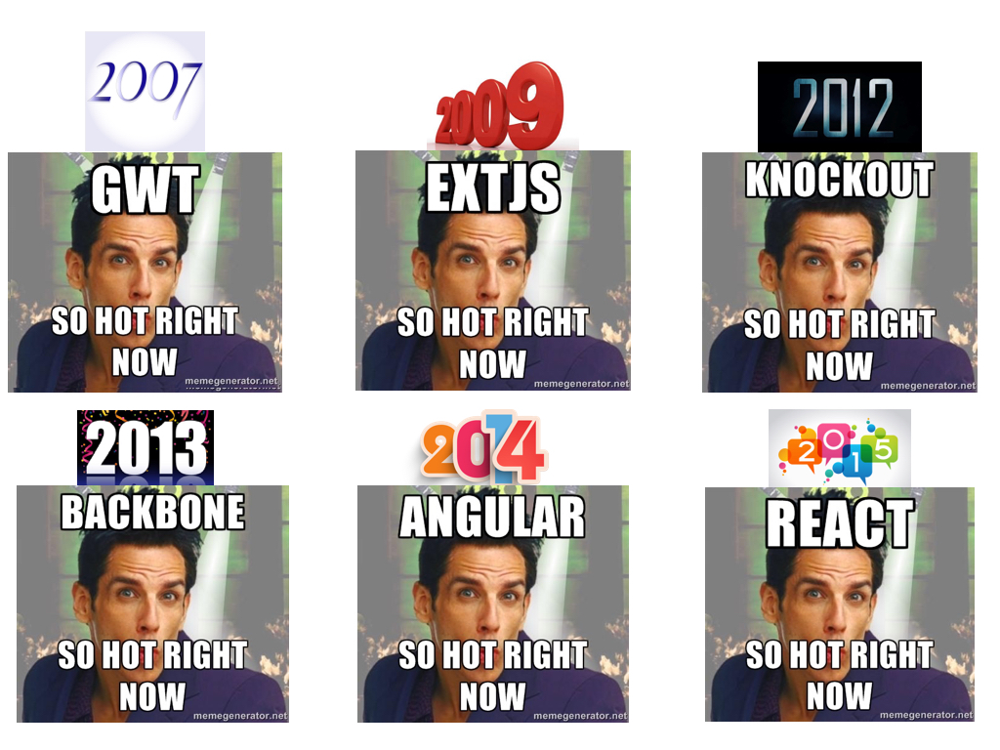
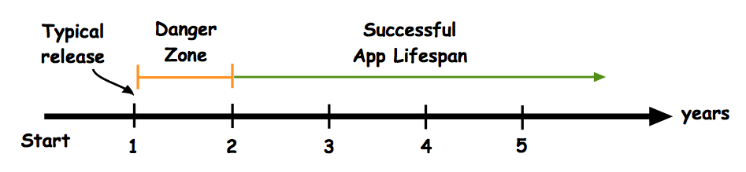
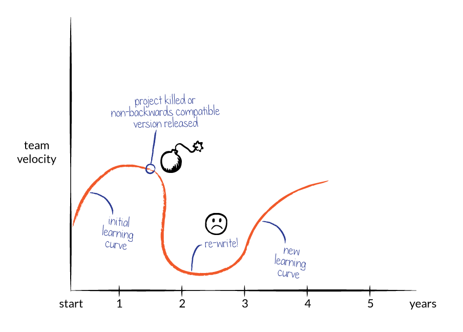
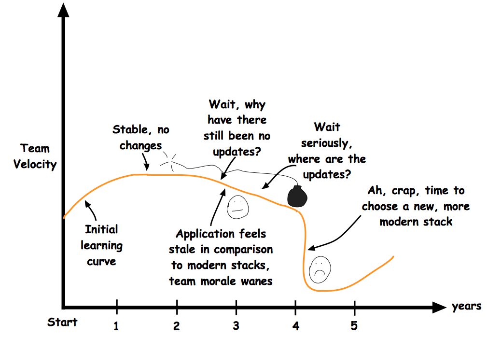
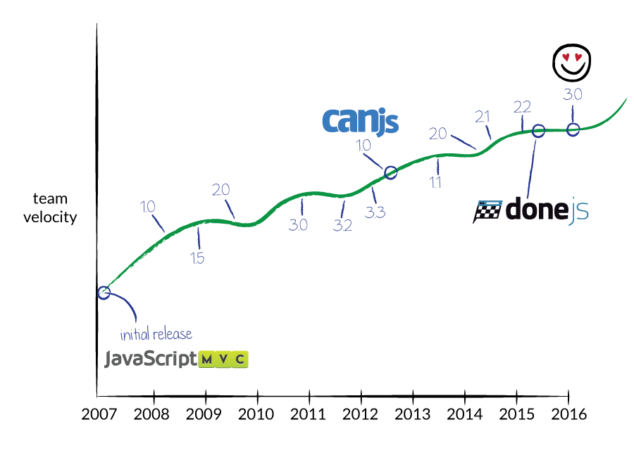
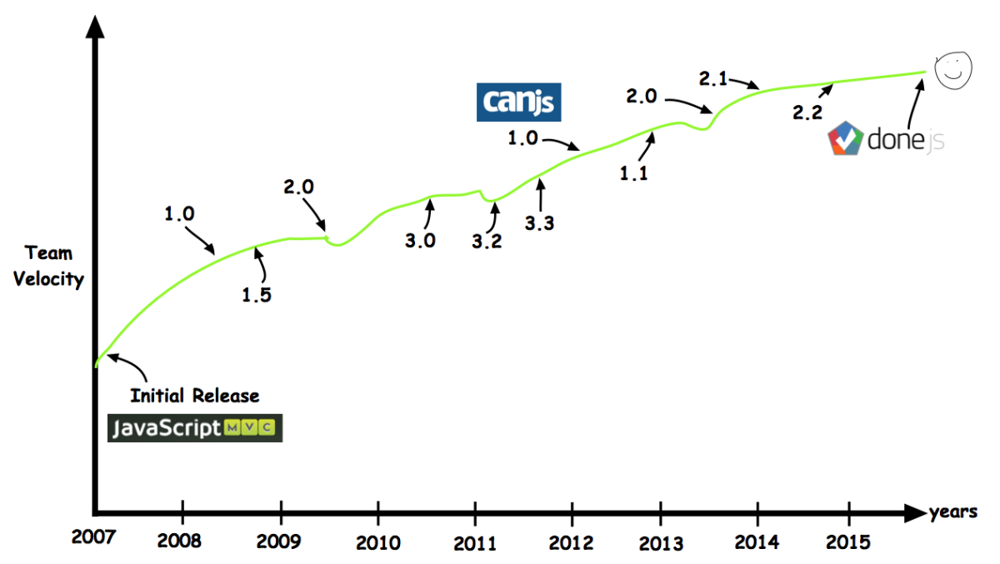
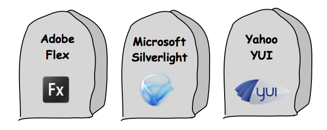

@page guides/why-canjs/business-advantages Business Advantages
@parent guides/why-canjs 1

@body

You may be familiar with the
[never-ending stream](https://medium.freecodecamp.com/javascript-fatigue-fatigue-66ffb619f6ce#.n5tt0jqhf)
of
[hot new JavaScript frameworks](http://www.allenpike.com/2015/javascript-framework-fatigue/)
that take our community by storm:

If
[chasing the hot new thing](https://hackernoon.com/how-it-feels-to-learn-javascript-in-2016-d3a717dd577f#.lrntx9nby)
isn’t for you, CanJS is the right framework for you.

CanJS’ goal is to be the antidote to this mentality, and we have the track record to prove it.

## Why your business needs a stable platform

Technology changes quickly, but applications last a long time.

From inception, a successful application (like Gmail) aims to last at least 5 years.

With a 1-2 year average turnover in the JavaScript framework game of thrones and a 5 year application lifespan, it’s safe to say that choosing frameworks based on popularity is not a good idea.

For example, say you were building an application and using the most popular choice at the time…

__4 years ago__ - You might have chosen KnockoutJS, which is a project that is no longer considered a modern framework and hasn’t been updated in some time.

__3 years ago__ - You might have chosen BackboneJS, which is a project that is no longer considered a modern framework and hasn’t been updated in some time.

__2 years ago__ - You might have chosen Angular 1, which is a project that was rewritten completely in version 2, without any backwards compatibility. You would have to rewrite your application to use a modern framework.

__1 year ago__ - You might have chosen React, before any of the many React frameworks like Redux became popular. You likely would have built your own mini-framework around React, or used the very lightweight Flux pattern that Facebook promotes, all of which would require a rewrite to use what is now considered a modern framework.

__Today__ - You might consider using Angular 2, but then realize you’ve already fallen for this trap. There must be a better way.

This is insanity. No reasonable developer should be expected to work like this. CanJS’ entire mission is to help developers weather this storm.

CanJS, which was originally called JavaScriptMVC before that project was split up into several pieces, including CanJS, in 2012, has been around since 2007. Every year, we have aimed to improve our stack by incorporating the latest best practices and ideas in the JavaScript world, while not leaving behind our existing users.

Had you chosen CanJS during any of the past 4 years (actually any year since 2007), you’d have a smooth upgrade path each year until the present 3.0 version, which shares many major characterics with Angular 2 and React’s more popular frameworks, but without the stink of broken promises.

Productivity-wise, making any other choice over the past 4 years would end up looking either like this:

Or like this:

But choosing CanJS would have looked like this:

Or more specifically, here’s what our major release schedule has looked like:

Notice the consistent 6 to 9 month release cadence.

## Why Your Business Needs an Innovative Platform

However, simply providing stability is not enough. Windows XP was a stable platform, but it sacrificed innovation for stability, causing stagnation.

Over the past 9 years that CanJS has been around, there has been constant change in the JavaScript community. Best practices have evolved and the platform of the web itself has evolved. As these changes have occurred, CanJS has filtered out the very best ideas and practices, and implemented them in evolving APIs.

To name a few:
- Event delegation became a best practice for managing events around 2009. CanJS added support for event delegation in can.Controls in 2008, before jQuery even landed support.
- RESTful APIs eventually became the best practice for designing a backend interface. can.Model in 2010 provided ActiveRecord style abstractions around this pattern.
- Data bindings hit the mainstream in 2013 when Angular rose in popularity. CanJS landed support for this feature in 2011.
- Building UI widgets as HTML custom elements, similar to web components, has become a best practice. can.Component landed in 2013 to support this architecture.
- In 2015, CanJS landed support for using a Virtual DOM and simple server-side rendering, as this idea was becoming more popular.

This timeline shows more examples:

<iframe src="https://cdn.knightlab.com/libs/timeline/latest/embed/index.html?source=1lBdurIQbbJkTZ8_kCQaXZtFaD06ulMFAlkqyEmXH4k0&amp;font=Bevan-PotanoSans&amp;maptype=toner&amp;lang=en&amp;start_at_slide=3&amp;height=650&amp;start_zoom_adjust=-2" width="100%" height="650" style="max-width:800px" frameborder="0"></iframe>

Client logos here

## Balancing Stability and Innovation: Our Approach

Given that the web is constantly changing, how do you balance the opposing forces of stability and innovation?

When you’re developing on a moving target, you need a platform that moves for you, so your application can stand on steady ground.

CanJS does this by taking upgrade paths very seriously. We aim to constantly add new features, but still make it easy on users who want to keep upgrading without changing all their code.

We use [semantic versioning](https://www.sitepoint.com/semantic-versioning-why-you-should-using/), so minor version upgrades, while they may support new features, will always be backwards-compatible. Upgrading to anything besides a major version will not break existing code.

For major version upgrades, such as 3.0, we provide an easy path to upgrade. For example, if you are an existing CanJS user using version 2.x looking to upgrade to the current version (3.0), there are three options, which all exist on a spectrum, each providing a tradeoff between work now and work later.

GRAPHIC
3 migration paths
Minimal				Modernized 			Future-proof
Minimal application changes		More changes required	Uses all the latest
Uses legacy shims so you barely 	Future upgrades will be	More work now, but
have to change anything		easier				future upgrades very easy
←------------------->

Users that want to upgrade painlessly will use the minimal path. This should be less than a few hours of work. Users that want to take fuller advantages of the new features and APIs will choose the modernized or future-proof options, which introduces slightly more risk.

Here is the [upgrade guide](https://canjs.com/guides/migrating.html) to for 1.x to CanJS 2.0.

The CanJS core team always tests release candidates against a suite of current production applications to ensure our users only get a stable, validated release.

## Longevity is More Important Than You Think

If you’re not yet convinced why balancing innovation and stability makes CanJS an excellent choice for businesses, consider this: all the modern frameworks have more or less converged in 2016. You can build a very similar application, with routing, observables, models, and server side rendering (with some exceptions) with Angular 2, several of the React frameworks, Ember, or CanJS. Therefore, the MOST important factor, even beyond small technical differences, is the longevity and stability of the framework. You want to bet on a horse that you can ride into the future, not the horse that looks prettiest today.

There’s no advantage to choosing projects maintained by a big company, since they often kill platforms that many developers have invested in.

There’s no advantage to choosing a framework with a large community, since communities are fickle and change yearly.

There’s no advantage to choosing a framework based on ability to hire devs that list X on their resume, since any competent JavaScript developer can be equally effective in any modern framework with a couple days of learning.

This is why CanJS has a stellar reputation with enterprise companies. Stability and longevity are critical factors to your application’s success.
