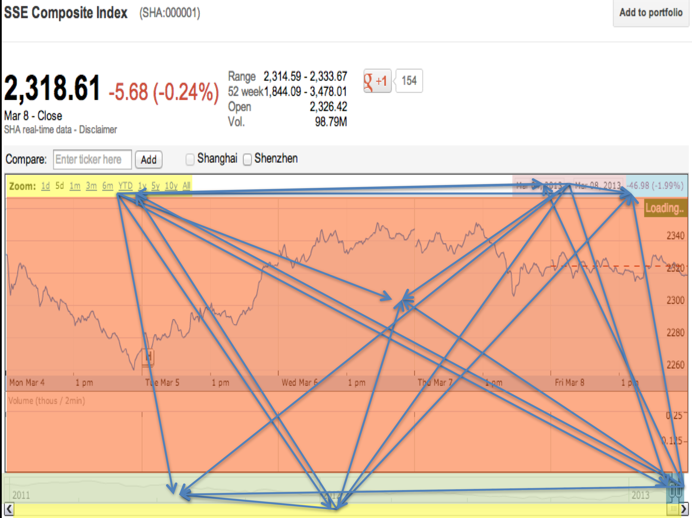
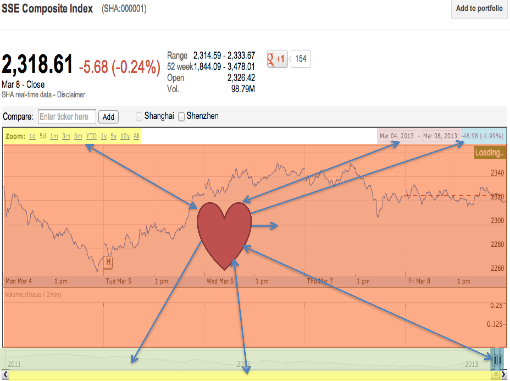
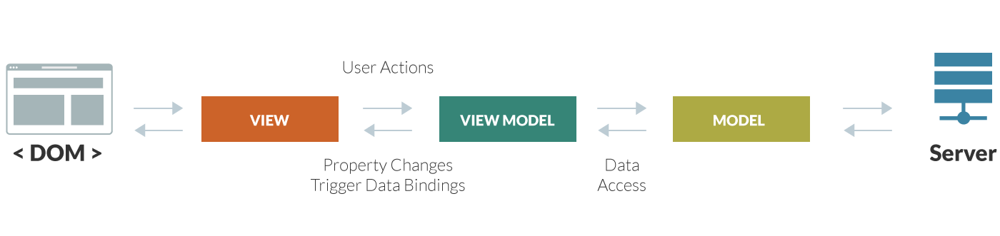

@page guides/why-canjs/technical Technical Highlights
@parent guides/why-canjs 2
@disableTableOfContents

@body

CanJS is a JavaScript MVVM library, with browser support all the way back to IE9.

## Size to features ratio

The core of CanJS, gzipped, is under 50KB. While there may be smaller architectural libraries, there aren’t competitors that rival CanJS that provide comparable functionality. For custom elements, observables, live binding, routing, a model layer with intelligent caching and real-time support, 50KB is very small.

jQuery 3.1 is 30KB minified and gzipped, and that is only providing DOM utilities. CanJS implements it’s own DOM utilities, in addition to much more.

Ember 2.9 is 108KB minified and gzipped, providing a comparable feature set.

React 15.3 is 44KB minified and gzipped, yet React is, on it’s own, simply a View layer.

The Angular 2’s Hello World app, provided by the angular-cli, is ~100KB minified and gzipped

## Modularity

CanJS, as of the 3.0 release, has been broken up into several dozen completely independent modules, each with it’s own separate npm package and version number using [Semantic Versioning](http://semver.org).

The obvious advantage of library modularity is that pieces can be used without the whole. You can choose to use Observables or can-fixture without the rest of the framework. You could even mix and match CanJS libraries with other libraries like React quite easily.

However, that’s not the main benefit modularity provides to users.

Why is this important? It makes it easy to balance stability and innovation.

### Faster, more stable framework releases

Because CanJS’ pieces can push out updates independently, small bug fixes and performance enhancements can be released immediately, with much lower risk. For example, if a bug is observed and fixed in can-compute, a new version of can-compute will be pushed out that day, as soon as tests pass.

By contrast, with the typical all-in-one structure, there will usually be a much longer delay between the can-compute bug fix and the next release. This is because making a new release for CanJS as a whole is a much more involved, risky endeavour. The can-compute change has to be tested much more rigorously against the framework as a whole. Plus there might be other changes in other areas in progress that need to land before the release can go out.

It’s similar to the difference between making plans with your best friend vs 10 of your friends. The larger group is going to move much more slowly because there are many more pieces to coordinate.

### Adopt new framework features without any upgrade effort or library bloat

For users that have an existing application, this modularity means they can leave their application and all it’s dependencies alone, forever, while using new features and parts of the library in other areas of the application.

For example, say an entire application is built with CanJS 3.0. The following year, the developer is tasked with adding a new feature. At that point, can-component 4.0 is out with an innovative new set of features. The developer can simply leave the remainder of the application using CanJS 3.0 (including can-component 3.0), and import can-component 4.0 in the new area of the application. It will likely still share the same lower level dependencies, since those are less likely to change very often, so this adds an insignificant amount of code weight.

Angular 1.x to 2.0 is a good counterexample to this approach. The recommended upgrade strategy was to either rewrite your application with 2.0 (a lot of extra work) or load your page with 1.X and 2.0, two full versions of the framework (a lot of code weight). Neither is preferable.

With the modularity described in CanJS, applications can import multiple versions of the high level APIs while avoiding the work of rewriting with future syntaxes and the extra code weight of importing two full frameworks.

## Observables

### What are they

Observables are special types of data that allow their property changes to be "observed" using typical event listeners. In modern web applications, they also enable “data bound” templates, which cause sections of the UI to be automatically re-rendered whenever certain data properties change, a powerful feature that removes large amounts of repetitive application code.

CanJS has an observable layer that is powerful, performant, and flexible. It binds together various parts of applications, using expressive property definitions.

```javascript
var define = require("can-define");

var Person = function(first, last){
  this.first = first;
  this.last = last;
};
define(Person.prototype,{
  first: { type: "string" },
  last: { type: "string" },
  fullName: {
    get: function(){
      return this.first+" "+this.last;
    }
  }
});
```

Observables are very powerful and easy to use on their own, but in CanJS applications, they are used in the ViewModel, a layer that sits between the model and the view and contains the state of the application. More on ViewModels [below](#ViewModels).

### Why they’re powerful

Observables as a concept enable an important architectural advantage in large applications.

Say you have an application with three discrete components.

Without observables, you might have component A tell component B to update itself when something happens, like user input.

With observables, you would separate the state of your application into a separate layer, and each component would be able to change parts of the state it cares about and listen to parts of the state it needs. When the same user input occurs, component A would update the observable state object. Component B would be notified that a property of the observable state has changed, and update itself accordingly.

Why is this better? Because this allows each component to be untied from the rest. They each get passed the state they need, but are unaware of the rest of the components and their needs. The architecture diagram changes from this:




To this:



Not only is this simpler to understand, these components are more easily testable and shareable, and changes are more contained are less risky to have unwanted side effects. All of these advantages are possible because of observables.

### Synchronous, Object oriented, and Functional

In CanJS observables, changes to a property in an object or array immediately and synchronously notify any event listeners.

Past versions of CanJS used a method called `attr` to set and get properties on observables. CanJS 3.0 has deprecated this method. In 3.0 you can set and get properties the old-fashioned way, and event listeners are still notified synchronously. This change is made possible using ES5 accessors (set and get). When all browsers support proxies, this will be even simpler.

This is in contrast to dirty checking observables, such as those used in Angular 1.X, which did not immediately notify listeners, but did so asynchronously after a digest cycle.

Synchronous code is always easier to debug and test.

CanJS observables are both object oriented and functional, leaving it up to the developer to decide which approach works better for the problem at hand.

They are object oriented because you can create observables out of any normal object or array, such as the example shown above. They are functional because you can use filter, map, and other functional helpers to compose properties that derive their value based on the changing state of other properties. For example:

```javascript
var TodoList = DefineList.extend({
    "#": Todo,
    get completed(){
        return this.filter({complete: true})
    }
});

var todos = new TodoList([{complete: true}, {complete:false}]);
todos.completed.length //-> 1
```

There is also a [can-stream project](https://github.com/canjs/can-stream) that converts observables into streams.

### Computed properties

Observables can define properties that depend on other properties, and they'll automatically recompute only when their dependent properties change. The `fullName` property above is an example of a computed property.

```javascript
var person = new Person("Justin", "Meyer");
person.first    //-> "Justin"
person.last     //-> "Meyer"
person.fullName //-> "Justin Meyer"
```

When `first` or `last` are changed, `fullName` is immediately changed as well, and any listeners of the `fullName` property synchronously notified.

### Data bound templates

Although not directly a feature of observables, data bound templates are a feature of CanJS Views that are tied closely with the observable layer.

Templates in CanJS bind to property changes and update the DOM as needed.

For example, there may be a template that looks like this:

```
<div>{{fullName}}</div>
```

If first is changed:

```javascript
person.first = 'Jane';
```

`fullName` recomputes, then the DOM automatically changes to reflect the new value.

Observables express complex relationships between data, without regard to its display. Views express properties from the observables, without regard to how the properties are computed. The app then comes alive with rich functionality.

### Expressive property definition syntax

Can-define supports an expressive, powerful syntax for defining properties on observable objects. It supports get, set, initial value, and type conversion

### Batched events

Observable property changes causing synchronous events that update the DOM is great for most scenarios, but there are times where this could cause performance problems. To prevent unnecessary DOM updates, events can be batched using `canBatch.start` and `canBatch.stop`.

Consider a todo list with a completeAll method that marks every todo in the list as complete and completeCount that counts the number of complete todos:

```javascript
var Todo = DefineMap.extend({
    name: "string",
    complete: "boolean"
});

var TodoList = DefineList.extend({
    "#": Todo,
    completeAll: function(){
        this.forEach(function(todo){
            todo.complete = true;
        })
    },
    completeCount: function(){
        return this.filter({complete: true}).length;
    }
})
```

When completeAll is called, the {{todos.completeCount}} magic tag will update once for every completed count. We can prevent this by wrapping completeAll with calls to start and stop:
```javascript
completeAll: function(){
    canBatch.start();
    this.forEach(function(todo){
        todo.complete = true;
    });
    canBatch.end();
},
```
### Inferred dependencies

In other libraries that support computed properties, you declare your dependencies, like this:

```javascript
fullName: Ember.computed('firstName', 'lastName', function() {

  return `${this.get('firstName')} ${this.get('lastName')}`;

})
```

In CanJS, computed properties are able to determine their own dependencies without needing to explicitly declare them, therefore requiring less boilerplate code and repetition.

The way this works is by keeping track of any properties referenced when the computed function first runs, and binding the computed property to those property change events.

Each time the computed function is run, these dependencies are re-evaluated, so even if there are different dependencies hiding in a conditional, those will be bound to the next time around.

```javascript
origFullName: {
  get: function(){
    if(this.gender == "female" && this.married) {
      return this.first+" "+this.last;
    } else {
      return this.first+" "+this.maiden;
    }
  }
}
```

### Compiled property behavior

In CanJS 3.0, getting and setting properties whose behavior is defined through can-define is 3x faster than the previous version. This was achieved by generating compiled functions for getting and setting each property based on the property definition when the object is defined. The previous implementations used conditionals to check if each property had, for example, a type definition, or a get function, etc, and run each behavior if it was found. Now, each property has an optimized function that runs only the behaviors that are defined.

This may not seem significant, but in fact this allows CanJS observables to provide the rich behaviors of can-define without sacrificing any performance. Competitor libraries either don’t allow for the same rich behaviors or are much slower performing gets and sets.

### Compared to other frameworks

In Angular 1.X, there are no direct observables. It uses dirty checking with regular JavaScript objects, which means at the end of the current $digest cycle, it will run an algorithm that determines what data has changed. This has performance drawbacks, as well as making it harder to write simple unit tests.

Angular 2.0

In React, there is no observable data layer. You could define a fullName like we showed above, but it would be recomputed every time render is called, whether or not it has changed. Though it's possible to isolate and unit test its ViewModel, it's not quite set up to make this easy. For more details on how other React-based frameworks compare, read [this](LINK).

## ViewModels

ViewModels are a type of observable that represents the state of a CanJS component. In CanJS, the ViewModel is it’s own layer, completely independent from the template and the component.

The introduction of a strong ViewModel provides key advantages for maintaining large applications:

* Decouples the presentation from its business logic - A ViewModel is essentially an object and methods representing the state of a View. This separation of concerns enables simple, dumb HTML-based Views containing minimal logic, while the ViewModel manages the complexities of application logic.

* Enables designer/developer cooperation - Because the view is stripped of code and application logic, designers can safely and comfortably change the View without fear of breaking things.

* Enables easier [testing](https://donejs.com/Features.html#section=section_ComprehensiveTesting) - ViewModels can be unit tested easily. Because they represent the view's state without any knowledge of the DOM, they provide a simple interface for testing.

### Independent ViewModels

CanJS ViewModels are unique in their independence from other layers. ViewModels and Views are completely decoupled, and can be developed completely isolated from a template.

For example, here's a typical ViewModel, which is often defined in its own separate file like viewmodel.js and exported as its own module:

```javascript
export const ViewModel = Map.extend({
  define: {
    fullName: {
      get () {
        return this.attr("first") + " " + this.attr("last");
      }
    }
  }
})
```

The template (view) lives in its own file, so a designer could easily modify it without touching any JavaScript. This template renders the ViewModel property from above:
```
<div>{{fullName}}</div>
```

A custom HTML element, also known as a component, would be used to tie these layers together:

```javascript
import Component from 'can/component/';
import ViewModel from "./viewmodel";
import template from './template.stache!';

Component.extend({
  tag: 'my-component',
  viewModel: ViewModel,
  template
});
```

The ViewModel is defined as its own module and exported as an ES6 module, so it can be imported into a unit test, instantiated, and tested in isolation from the DOM:

```javascript
import ViewModel from "./viewmodel";

QUnit.test('fullName works', function() {
  var vm = new ViewModel();
  vm.attr('first', 'John');
  vm.attr('last', 'Doe');
  QUnit.equal(vm.attr('fullName'), 'John Doe');
});
```

In other frameworks, ViewModels don't enjoy this level of independence. Every React class has a render function, which is essentially a template, so the View, ViewModel, and component definition are typically part of the same module. Every Angular directive is a ViewModel. In CanJS, separating the ViewModel, template, and custom element is encouraged, making each module more decoupled and easier to unit test.

## MVVM

CanJS applications employ a [Model-View-ViewModel](https://en.wikipedia.org/wiki/Model_View_ViewModel) architecture pattern.



### MVVM overview

**Models** in CanJS are responsible for loading data from the server. They can be reused across ViewModels. They often perform data validation and sanitization logic. Their main function is to represent data sent back from a server. Models use intelligent set logic that enables real time integration and caching techniques.

**Views** are templates. Specifically, templates that use handlebars syntax, but with data bindings and rewritten for better performance. Handlebars templates are designed to be logic-less.

**ViewModels** were covered in detail above.

### Composed, hierarchical state

CanJS applications are composed from hierarchical components, each containing their own independent state (it’s own ViewModel). This architecture is at the core of CanJS’ approach to building large applications.

The secret to building large apps is never build large apps. Break your applications into small pieces. Then, assemble those testable, bite-sized pieces into your big application.

Hierarchical State Machines (HSMs) is one way to describe this concept. UML diagrams allow for modeling of [hierarchically nested states](https://en.wikipedia.org/wiki/UML_state_machine#Hierarchically_nested_states), such as those in CanJS applications. Check out the [ATM guide](LINK) for an example of a hierarchical state machine implemented using hierarchical ViewModels.

React, and other competing frameworks, have a big global state object that contains the application’s state. The problem with this approach, at least in any application with even moderate complexity, is that this monolithic layer becomes a dependency of every component in the application. This creates additional downstream problems:

* Changes to the state object can have non-obvious and harmful side effects, causing unexpected bugs.

* It becomes harder to work independently on one component of the project. Thus, scaling the team and parallelizing the effort becomes trickier, as several developers might have to touch the same central state layer.

* Individual components become less reusable in other contexts because of their dependency on this external state layer.

* Individual components become harder to test in isolation, since testing them requires importing or mocking large external dependencies

### Caching and minimal data requests

DoneJS improves performance by intelligently managing the data layer, taking advantage of various forms of caching and request reduction techniques.

Undoubtedly, the slowest part of any web application is round trips to the server. Especially now that [more than 50% of web traffic comes from mobile devices](http://searchengineland.com/its-official-google-says-more-searches-now-on-mobile-than-on-desktop-220369), where connections are notoriously slow and unreliable, applications must be smart about reducing network requests.

Making matters worse, the concerns of maintainable architecture in single page applications are at odds with the concerns of minimizing network requests. This is because independent, isolated UI widgets, while easier to maintain, often make AJAX requests on page load. Without a layer that intelligently manages those requests, this architecture leads to too many AJAX requests before the user sees something useful.

With DoneJS, you don't have to choose between maintainability and performance.

DoneJS uses the following strategies to improve perceived performance (reduce the amount of time before users see content rendered):

* [Fall through caching](https://donejs.com/Features.html#section=section_CachingandMinimalDataRequests__Howitworks__Fallthroughcaching) - Cache data in localStorage. Automatically show cached data immediately, but look for updates on the server in the background and merge changes.

* [Combining requests](https://donejs.com/Features.html#section=section_CachingandMinimalDataRequests__Howitworks__Combiningrequests) - Instead of making multiple, independent requests to the same API, combine them into a single request.

* [Request caching](https://donejs.com/Features.html#section=section_CachingandMinimalDataRequests__Howitworks__Requestcaching) - Reduce the number and size of server requests by intelligently using cached datasets.

* [Inline cache](https://donejs.com/Features.html#section=section_CachingandMinimalDataRequests__Howitworks__Inlinecache) - Use data embedded in the page response instead of making duplicate requests.

#### **How it works**

[can-connect](http://connect.canjs.com/) makes up part of the DoneJS model layer. Since all requests flow through this data layer, by making heavy use of set logic and localStorage caching, it's able to identify cache hits, even partial hits, and make the most minimal set of requests possible.

It acts as a central hub for data requests, making decisions about how to best serve each request, but abstracting this complexity away from the application code. This leaves the UI components themselves able to make requests independently, and with little thought to performance, without actually creating a poorly performing application.

##### **Fall through caching**

Fall through caching serves cached data first, but still makes API requests to check for changes.

The major benefit of this technique is improved perceived performance. Users will see content faster. Most of the time, when there is a cache hit, that content will still be accurate, or at least mostly accurate.

This benefits two types of situations. First is page loads after the first page load (the first page load populates the cache). This scenario is less relevant when using server-side rendering. Second is long lived applications that make API requests after the page has loaded. These types of applications will enjoy improved performance.

By default, this is turned on, but can easily be deactivated for data that should not be cached.

Here's how the caching logic works:

1. When the application loads, it checks for available cache connections.

2. When a request is made, it checks for a cache hit.

3. If there is a hit, the request is completed immediately with the cached data.

4. Regardless of a hit or miss, a request is made in the background to the actual API endpoint.

5. When that response comes back, if there was a difference between the API response data and the cache hit data, the initial request promise's data is updated with the new data. Template data bindings will cause the UI to update automatically with these changes.

6. Updated response data is automatically saved in the cache, to be used for future requests - whether that's in the current page session, or when the user comes back in the future.

##### **Combining requests**

Combining requests combines multiple incoming requests into one, if possible. This is done with the help of [set algebra](https://en.wikipedia.org/wiki/Algebra_of_sets).

DoneJS collects requests that are made within a few milliseconds of each other, and if they are pointed at the same API, tries to combine them into a single superset request.

For example, the video below shows an application that shows two filtered lists of data on page load - a list of completed and incomplete todos. Both are subsets of a larger set of data - the entire list of todos.

Combining these into a single request reduces the number of requests. This optimization is abstracted away from the application code that made the original request.

##### **Request caching**

Request caching is a type of caching that is more aggressive than fallthrough caching. It is meant for data that doesn't change very often. Its advantage is it reduces both the number of requests that are made, and the size of those requests.

There are two differences between request and fallthrough caching:

1. Cached data is not invalidated.

Once data is in the cache, no more requests to the API for that same set of data are made. You can write code that invalidates the cache at certain times, or after a new build is released.

1. The smallest possible request is made, based on the contents of the cache, and merged into a complete result set.

The request logic is more aggressive in its attempts to find subsets of the data within the cache, and to only make an API request for the subset NOT found in the cache. In other words, partial cache hits are supported.

The video below shows two example scenarios. The first shows the cache containing a supserset of the request. The second shows the cache containing a subset of the request.

##### **Inline cache**

Server-side rendered single page apps (SPAs) have a problem with wasteful duplicate requests. These can cause the browser to slow down, waste bandwidth, and reduce perceived performance.

1. When a page is rendered server-side, it makes data requests on the server to various APIs.

2. After the page's rendered HTML loads in the client, the SPA is loaded in the client, so that subsequent requests are handled within the SPA.

3. The SPA will want to re-request for the same data that was already requested on the server.

DoneJS solves this problem with an inline cache - embedded inline JSON data sent back with the server rendered content, which is used to serve the initial SPA data requests.

DoneJS uniquely makes populating and using the inline cache easy. waitFor is a method that:

1. Tells the SSR server to wait for a promise to resolve before rendering.

2. Collects data from each promise and uses it to populate the inline cache.

For example:

```javascript
can.Component.extend({
  tag: "user-name",
  template: can.stache( "{{user.name}}" ),
  viewModel: {
    init: function () {
      var promise = User.getOne( { id: this.attr( "id" ) } );
      this.attr( "%root" ).waitFor( promise );
      promise.then( ( user ) => { this.attr( "user", user ); } );
    }
  }
});
```

The model layer seamlesslly integrates the inline cache in client side requests, without any special configuration.

While this flow would be possible in other SSR systems, it would require manually setting up all of these steps.
