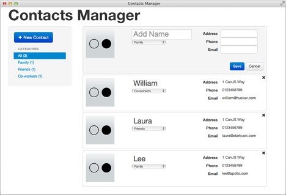
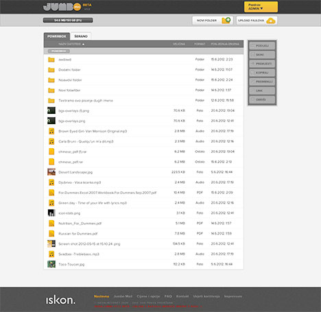
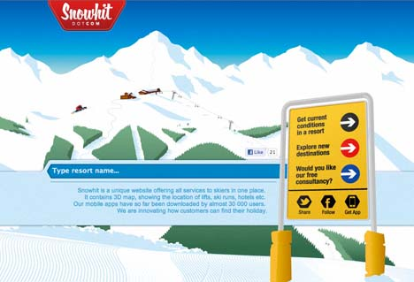
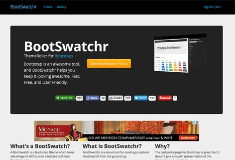
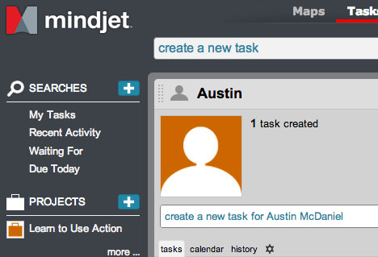

# Welcome to CanJS!

CanJS is a MIT-licensed, client-side, JavaScript framework that makes building
rich web applications easy. Use it because it's:

<ul class="checkmarks cf">
  <li>
    <a href="#why_canjs-size">Smaller</a>
    

      Only 11k!
      

    

  </li>
  <li>
    <a href="#why_canjs-speed">Faster</a>
    

      <a href="http://canjs.us/#why_canjs-speed">Fastest</a> control initialization and live binding
      

    

  </li>
  <li>
    <a href="#can_control">Safer</a>
    

      <a href="http://canjs.us/#why_canjs-safety">Memory safe</a> controls and model stores
      

    

  </li>
  <li>
    <a href="#examples">Easier</a>
    

      <a href="http://donejs.com/docs.html#!">Through documentation</a>, <a href="#examples">example apps</a> and <a href="http://canjs.us/recipes.html">example recipes</a>
      

    

  </li>
  <li>
    <a href="#get_canned">Library-er</a>
    

      Integrates with jQuery, Dojo, YUI, Zepto, Mootools.
      

    

  </li>
</ul>

[Learn why CanJS is better](#why_canjs). 



## Get Canned

CanJS's core supports jQuery, Zepto, Dojo, YUI and Mootools. Select your core download 
below or select the individual plugins above and click download:

 - [can.jquery.js](https://github.com/downloads/bitovi/canjs/can.jquery-{{page.version}}.js) ([min](https://github.com/downloads/bitovi/canjs/can.jquery-{{page.version}}.min.js))
 - [can.zepto.js](https://github.com/downloads/bitovi/canjs/can.zepto-{{page.version}}.js) ([min](https://github.com/downloads/bitovi/canjs/can.zepto-{{page.version}}.min.js))
 - [can.dojo.js](https://github.com/downloads/bitovi/canjs/can.dojo-{{page.version}}.js) ([min](https://github.com/downloads/bitovi/canjs/can.dojo-{{page.version}}.min.js))
 - [can.mootools.js](https://github.com/downloads/bitovi/canjs/can.mootools-{{page.version}}.js) ([min](https://github.com/downloads/bitovi/canjs/can.mootools-{{page.version}}.min.js))
 - [can.yui.js](https://github.com/downloads/bitovi/canjs/can.yui-{{page.version}}.js) ([min](https://github.com/downloads/bitovi/canjs/can.yui-{{page.version}}.min.js))

The [Using CanJS](#using_canjs)
section details the minor differences among use 
with other libraries. 

## Learn

Our goal is to make learning CanJS as easy as possible. There are a number of resources to use:

__[This Page](http://canjs.us)__ - Walks through the basics of CanJS by building the following 
small todo app with CanJS and jQuery:

<iframe style="width: 100%; height: 300px" 
        src="http://jsfiddle.net/donejs/5zpFz/embedded/result,html,js,css"
        allowfullscreen="allowfullscreen" 
        frameborder="0">JSFiddle</iframe>

Click a todo to edit it.  Use the browser's forward and back buttons to change what todo is being edited.

__[Getting Started With CanJS Video](http://www.youtube.com/watch?v=GdT4Oq6ZQ68)__ - An in-depth walkthrough of 
CanJS. If you have 42 minuites, you will learn CanJS and how the todo app was built.

__[In Depth Documentation](http://donejs.com/docs.html#!canjs)__ - Want to know the deepest details of CanJS's API? 

__[Recipes](http://canjs.us/recipes.html)__ - Checkout some nifty functionality built with CanJS.

__[Example Apps](#examples)__ - How CanJS has been put to good use. 

__Annotated Source__ - for [jQuery](http://canjs.us/release/latest/docs/can.jquery.html), [Zepto](http://canjs.us/release/latest/docs/can.zepto.html),
[Dojo](http://canjs.us/release/latest/docs/can.dojo.html),
[MooTools](http://canjs.us/release/latest/docs/can.mootools.html),
[YUI](http://canjs.us/release/latest/docs/can.yui.html)

__[Test Suite](http://ci.javascriptmvc.com/jobs/can/test/test.html)__ - See how we poke around the API.

## can.Construct `can.Construct( [classProperties,] [prototypeProperties] )`

Constructor functions made with [can.Construct](http://donejs.com/docs.html#!can.Construct) are used to create
objects with shared properties. It's used by both __can.Control__ and __can.Model__.

To create a constructor function of your own, call __can.Construct__ with the:

- __classProperties__ that are attached directly to the constructor, and
- instance __prototypeProperties__.

__can.Construct__ sets up the prototype chain so subclasses can be further 
extended and sub-classed as far as you like:


var Todo = can.Construct({
  init: function(){},
  
  author: function() { ... },
  
  coordinates: function() { ... },
  
  allowedToEdit: function( account ) { 
    return true;
  }
});
  
var PrivateTodo = Todo({
  allowedToEdit: function( account ) {
    return account.owns( this );
  }
});


If only one set of properties is passed to __can.Construct__, it's assumed to 
be the prototype properties.

### init `new can.Construct( [args ...] )`

When a constructor is called with the `new` keyword, __can.Construct__ creates the instance and 
calls [can.Construct.prototype.init](http://donejs.com/docs.html#!can.Construct.prototype.init) with 
the arguments passed to `new Constructor(...)`.


var Todo = can.Construct({
  init: function( text ) {
    this.text = text
  },
  read: function() {
    console.log( this.text );
  }
})
  
var todo = new Todo( 'Hello World' );
todo.read()


## can.Observe `new can.Observe( data )`

[can.Observe](http://donejs.com/docs.html#!can.Observe) provides the observable pattern for JavaScript Objects. It lets you:

 - Set and remove property values on objects.
 - Listen for property changes.
 - Work with nested properties.

To create an observable object, use `new can.Observe( [data] )` like:


var paginate = new can.Observe( { offset: 0, limit: 100, count: 2000 } )


To create an observable array, use `new can.Observe.List( [array] )` like:


var hobbies = new can.Observe.List( ['programming', 
                             'basketball', 
                             'party rocking'] )


__can.Observe__ is used by both [can.Model](#can_model) and [can.route](#can_route). However, observe 
is useful on its own to maintain client-side state (such as pagination data). 

### attr `observe.attr( [name,] [value] )`

[can.Observe.prototype.attr](http://donejs.com/docs.html#!can.Observe.prototype.attr) reads or 
sets properties on an observe:


paginate.attr( 'offset' ) //-> 0
  
paginate.attr( 'offset', 100 );
  
paginate.attr() //-> { offset: 100, limit: 100, count: 2000 }
  
paginate.attr( { limit: 200, count: 1000 } );


### removeAttr `observe.removeAttr( name )`

[can.Observe.prototype.removeAttr](http://donejs.com/docs.html#!can.Observe.prototype.removeAttr) removes a property 
by name from an observe.  This is similar to using the `delete` keyword to remove a property.


o = new can.Observe( { foo: 'bar' } );
o.removeAttr( 'foo' ); //-> 'bar'


### bind `observe.bind( eventType, handler(args...) )`

[can.Observe.prototype.bind](http://donejs.com/docs.html#!can.Observe.prototype.bind) listens to
changes on a __can.Observe__.  There are two types of events triggered as a 
result of an attribute change:

 - `change` events - a generic event so you can listen to any property change and how it was changed
 - `ATTR_NAME` events - bind to specific attribute changes

The following listens to all attribute changes and 'offset' changes on the paginate instance:


paginate.bind( 'change', function( ev, attr, how, newVal, oldVal ) {
   // attr = 'offset'
   // how = 'set'
   // newVal = 200
   // oldVal = 100
}).bind( 'offset', function( ev, newVal, oldVal ) {
   // newVal = 200
   // oldVal = 100
})
paginate.attr( 'offset', 200 );


### unbind `observe.unbind( eventType, handler )`

[can.Observe.prototype.unbind](http://donejs.com/docs.html#!can.Observe.prototype.unbind) stops listening
to an event.  The same function that was used for the handler in `bind` must be passed to `unbind`.


var countHandler = function( ev, newVal, oldVal ) {
  console.log( 'the count has changed' );
}
paginate.bind( 'count', countHandler );
paginate.attr( 'count', 3000 );
paginate.unbind( 'count', countHandler );
  

### each `observe.each( handler(value, attrName) )`

[can.Observe.prototype.each](http://donejs.com/docs.html#!can.Observe.prototype.each) iterates through 
each attribute, calling handler with each attribute value and name.


paginate.each(function( value, name ) {
   console.log( name, value );
})
// writes:
//  offset 200
//  limit 200
//  count 1000
  

### can.Observe.List `new can.Observe.List( [array] )`

[can.Observe.List](http://donejs.com/docs.html#!can.Observe.List) inherits from __can.Observe__
but adds list specific methods such as:

 - [indexOf](http://donejs.com/docs.html#!can.Observe.List.prototype.indexOf) `list.indexOf( item )` - Returns 
   the position of the item in the list.
 - [pop](http://donejs.com/docs.html#!can.Observe.List.prototype.pop) `list.pop()` - removes the last item in the list.
 - [push](http://donejs.com/docs.html#!can.Observe.List.prototype.push) `list.push( items... )` - adds items to the end of the list.
 - [shift](http://donejs.com/docs.html#!can.Observe.List.prototype.shift) `list.shift()` - removes the first item in the list.
 - [splice](http://donejs.com/docs.html#!can.Observe.List.prototype.splice) `list.splice( index, howMany, [ items... ] )` - removes and inserts items at the specified index.
 - [unshift](http://donejs.com/docs.html#!can.Observe.List.prototype.unshift) `list.unshift( items... )` - adds items to the start of the list.


var hobbies = new can.Observe.List( [ 'programming', 
                               'basketball', 
                               'party rocking' ] )
                               
// listen to changes in the list
hobbies.bind( 'add', function( ev, newVals, index ) {
  console.log( 'added', newVals, 'at', index );
}).bind( 'remove', function( ev, oldVals, index ) {
  console.log( 'removed', oldVals, 'at', index );
})

// modify the list
hobbies.pop()
hobbies.unshift( 'rocking parties' )
  

### can.compute `can.compute( [getterSetter,] [context] ) -> compute`

[can.compute](http://donejs.com/docs.html#!can.compute) represents some value that can be:
 - __read__ - by calling the compute like `compute()`
 - __updated__ - by passing a new value like `compute("new value")`
 - __listened__ to for changes - like `compute.bind("change",handle(ev,newVal,oldVal))`

The value the compute represents can be:

 - A __static__ JavaScript value like `"Hello"` or `{foo: "bar"}`
 - A __composite__ value of one or more [can.Observe](#can_observe) property values.
 - A __converted__ value derived from another value.

#### Static Values

`can.compute([value])` creates a computed with some value. For example


// create a compute
var age = can.compute(29);

// read the value
console.log("my age is currently", age());

// listen to changes in age
age.bind("change", function(ev, newVal, oldVal){
  console.log("my age changed from",oldVal,"to",newVal)
})
// update the age
age(30);


#### Composite values

`can.compute( getter(), context )` creates a compute that represents a composite value of one or more
can.Observe properties and can.computes.  The following `fullName` compute
represents the `person` observe's first and last name:


var person = new can.Observe({
  first : "Justin",
  last : "Meyer"
});
var fullName = can.compute(function(){
  return person.attr("first") +" "+ person.attr("last")
})

fullName() //-> "Justin Meyer"

fullName.bind("change", function(ev, newVal, oldVal){
  console.log("fullName changed from", oldVal,"to",newVal)
});

person.attr({
  first: "David",
  last: "Luecke"
})


`can.compute` caches computed values so reads are fast.

#### Converted Values

`can.compute( getterSetter( [newVal] ) )` can be used to convert one value into another. The following
creates a `percentage` compute that ranges from 0-100 that is cross bound to an observe's progress
property that ranges from 0-1.


var project = new can.Observe({
  progress :  0.5
});
var percentage = can.compute(function(newVal){
  // are we setting?
  if(newVal !=== undefined){
    project.attr("progress", newVal / 100)  
  } else {
    return project.attr("progress") * 100;  
  }
})

// We can read from percentage.
percentage() //-> 50

// Write to percentage,
percentage(75)
// but it updates project!
project.attr('progress') //-> 0.75


### Batch Operations

Use [can.Observe.startBatch](http://donejs.com/docs.html#!can.Observe.static.startBatch) and
[can.Observe.stopBatch](http://donejs.com/docs.html#!can.Observe.static.stopBatch) to
enable [atomic/batch operations](http://donejs.com/docs.html#!can.Observe.batchEvents). The
following prevents all events from being triggered on `person` and `items` until
after `can.Observe.stopBatch()` is called.


var person = new can.Observe({first: "Josh", last: "Dean"}),
    list = new can.Observe.List([
      {selected: false},
      {selected: true },
      {selected: false}
    ]);

person.bind("change", function(){} );
list.bind("change", function(){} );

can.Observe.startBatch();
person.attr("first", "Joshua");
list.each( function( item ) {
  item.attr('selected', true)
})
can.Observe.stopBatch();


Batching operations can improve performance, especially with live-binding.

## can.Model `can.Model( [classProperties,] [prototypeProperties] )`

[can.Model](http://donejs.com/docs.html#!can.Model) is a [can.Observe](#can_observe) that connects
to a RESTful interface.

Extend [can.Model](http://donejs.com/docs.html#!can.Model) with your domain specific 
methods and can.Model provides a set of methods 
for managing changes.

To create a __Model__ class, call __can.Model__ with:

- __classProperties__, including 
  [findAll](http://donejs.com/docs.html#!can.Model.static.findAll),
  [findOne](http://donejs.com/docs.html#!can.Model.static.findOne),
  [create](http://donejs.com/docs.html#!can.Model.static.create),
  [update](http://donejs.com/docs.html#!can.Model.static.update),
  [destroy](http://donejs.com/docs.html#!can.Model.static.destroy) properties, and
- any __prototypeProperties__ helper methods.

Make a Todo model in __todos.js__ like the following:


var Todo = can.Model({
  findAll : 'GET /todos',
  findOne : 'GET /todos/{id}',
  create  : 'POST /todos',
  update  : 'PUT /todos/{id}',
  destroy : 'DELETE /todos/{id}'
}, {})


### init `new can.Model(attributes)`

Create a todo instance like:


var todo = new Todo( { name: 'do the dishes' } );


### attr `model.attr( name, [value] )`

[can.Model.prototype.attr](http://donejs.com/docs.html#!can.Model.prototype.attr) reads or sets properties 
on model instances.  It works the same way as [can.Observe.prototype.attr](#can_observe-attr).


todo.attr( 'name' ) //-> 'do the dishes'

todo.attr( 'name', 'wash the dishes' );

todo.attr() //-> { name: 'wash the dishes' }

todo.attr( { name: 'did the dishes' } );


### Talking to the server

Model uses static [findAll](http://donejs.com/docs.html#!can.Model.static.findAll),
[findOne](http://donejs.com/docs.html#!can.Model.static.findOne), [create](http://donejs.com/docs.html#!can.Model.static.create),
[update](http://donejs.com/docs.html#!can.Model.static.update), and [destroy](http://donejs.com/docs.html#!can.Model.static.destroy)
methods to create, read, update and delete (CRUD)
model data on the server.  

By filling these functions out, you are able to call __findAll__ and __findOne__ on the model 
to retrieve model instances and __save__ and __destroy__ on instances.

### findAll `findAll( params, success( models ), error() ) -> Deferred`

[can.Model.findAll](http://donejs.com/docs.html#!can.Model.static.findAll) retrieves multiple instances
from the server:


Todo.findAll( {}, function( todos ) {
  console.log( todos[0].name );
}) //-> Deferred


This makes a request to `GET /todos` which should return JSON like:


[{
  "id" : 1,
  "name" : "do the dishes"
},{
  "id" : 2,
  "name" : "mow the lawn"
},{
  "id" : 3,
  "name" : "iron my shirts"
}]


The __todos__ parameter is a [can.Model.List](#can_model-can_model_list) of 
todo instances. `Todo.findAll` returns a [deferred](#utilities-deferred) that resolves to 
the __todos__ list.

### findOne `findOne( params, success( model ), error() ) -> Deferred`

[findOne](http://donejs.com/docs.html#!can.Model.static.findOne) retrieves a single model instance:


Todo.findOne( { id: 1 }, function( todo ) {
  console.log( todo.name );
})


This makes a request to `GET /todos/{id}` which should return JSON like:


{
  "id" : 1,
  "name" : "do the dishes"
}


The __todo__ parameter is model instance. `Todo.findOne` returns a [deferred](#utilities-deferred) that resolves to 
the __todo__ instance.

### save `todo.save( success( todo ), error() ) -> Deferred`

[can.Model.prototype.save](http://donejs.com/docs.html#!can.Model.prototype.save) __creates__ 
or __updates__ instances depending if the 
instance has already been created or not.

To __create__ a todo on the server, create a
todo instance and call __save__ like the following:


var todo = new Todo({name: "mow lawn"})
todo.save(function( todo ) {
  console.log( todo );
})


This makes a request to `PUT /todos` with `name=mow lawn` and should get a response with the __id__ like:


{ "id" : 5 }


__save__ calls back with the original todo instance and returns a [deferred](#utilities-deferred) that resolves
with the todo after it has been created on the server.

To __update__ a todo on the server, change the attributes
and call __save__ again like the following:


var todo = new Todo( { name: 'mow lawn' } );
todo.save(function( todo ) {
  console.log( 'created', todo );
  
  todo.attr( 'name', 'mow my lawn' )
  todo.save(function( todo ) {
    console.log( 'updated', todo );
  })
})


This makes a request to `POST /todos/5` with `name=mow my lawn` and only needs to get a successful response.

### destroy `todo.destroy( success( todo ), error() ) -> Deferred`

[can.Model.prototype.destroy](http://donejs.com/docs.html#!can.Model.prototype.destroy) deletes a 
record on the server.  You can do this like:


var todo = new Todo( { name: 'mow lawn' } );
todo.save(function( todo ) {
  console.log( 'created', todo );
  
  todo.destroy(function( todo ) {
    console.log( 'destroyed', todo );
  })
})


This makes a request to `DELETE /todos/5` and only needs a successful response.  Like __save__, the 
callback's `todo` parameter is the destroyed instance and a [deferred](#utilities-deferred) is returned that
resolves with the `todo` after it has been destroyed by the server.

### bind `model.bind( event, handler( ev, model ) ) -> model`

[can.Model.prototype.bind](http://donejs.com/docs.html#!can.Model.prototype.bind)
listens to changes in a model instance's attributes in the same way as 
[Observe's bind](#can_observe-bind).  For example:


todo.bind( 'name', function( ev, newVal, oldVal ) {
  console.log( 'name changed to', newVal );
})


In addition to Observe's events, Model also supports three new events:

- __created__ - an instance is created on the server
- __updated__ - an instance is updated on the server
- __destroyed__ - an instance is destroyed on the server

For example, listen for 
when an instance is __created__ on the server like:


var todo = new Todo( { name: 'mow lawn' } );
todo.bind( 'created', function( ev, todo ) {
  console.log( 'created', todo );
})
todo.save()


[can.Model.bind](http://donejs.com/docs.html#!can.Model.static.bind) lets you listen for 
anytime __any__ instance is __created__, __updated__, or __destroyed__:


Todo.bind( 'created', function( ev, todo ){
  console.log( 'created', todo );
})


### can.Model.List `new can.Model.List( items )`

[can.Model.List](http://donejs.com/docs.html#!can.Model.List) is a 
[can.Observe.List](#can_observe-can_observe_list) that automatically removes items when they are 
destroyed.  __Model.Lists__ are returned by [findAll](#can_model-findall).


Todo.findAll( {}, function( todos ) {

  // listen for when a todo is removed
  todos.bind( 'remove', function( ev, removed, index ) {
    console.log( 'removed', removed.length, 'todos' );
  })
  
  // destroy the first todo
  todos[0].destroy()
})


## can.view `can.view( idOrUrl, data ) -> documentFragment`

[can.view](http://donejs.com/docs.html#!can.view) is used to load, render, and create HTMLElements from
JavaScript templates. Pass it ...

- the __id__ or __URL__ of a script tag to use as the content of the template
- __data__ to pass to the template
  
It returns the rendered result of the template as a documentFragment (a documentFragment is a lightweight
container that can hold DOM elements in it).  


document.getElementById( 'todos' )
  .appendChild( can.view( 'todos.ejs', [ { name: 'mow lawn' } ] ) )


`can.view` supports multiple templating languages; however, [can.EJS](#can_ejs)
is packaged with CanJS and supports live-binding of [can.Observe](#can_observe).

### Loading Templates

`can.view` loads templates from a URL or a script tag. To load from
a __script__ tag, create a script tag with the template contents, an id, 
and a type attribute that specifies the template type (text/ejs).

For example, add the following __html__:





Render this template and insert it into the page:


Todo.findAll( {}, function( todos ) {
   document.getElementById( 'todos' )
           .appendChild( can.view( 'todosEJS', todos ) );
} );


To load from a __URL__,  create
a _todos/todos.ejs_ file that contains:


<% for( var i = 0; i < this.length; i++ ) { %>
  <li><%= this[ i ].name %></li>
<% } %>


Render this with:


Todo.findAll( {}, function( todos ) {
  document.getElementById( 'todos' )
           .appendChild( can.view( 'todos/todos.ejs', todos ) );
} );


### Deferreds

__can.view__ accepts [deferreds](#utilities-deferred).  If the `data` argument is a deferred or an object
that contains deferreds, __can.view__ returns a deferred that resolves to the documentFragment after
all deferreds have resolved and the template has loaded.

[can.Model.findAll](#can_model-findall) returns deferreds. This means that the following loads `todos/todos.ejs`, `Todo.findAll` and `User.findOne`
in parallel and resolves the returned deferred with the documentFragment when they are all done:


can.view( 'todos/todos.ejs', {
  todos: Todo.findAll(),
  user: User.findOne( { id: 5 } )
} ).then(function( frag ){
  document.getElementById( 'todos' )
          .appendChild( frag );
})

    

### render `can.view.render( idOrUrl, data )`

To render a string instead of a documentFragment, use can.view.render like:


<% for( var i = 0; i < todos.length; i++ ) { %>
  <li><%== can.view.render( '/todos/todo.ejs', {
             todo: todo[ i ]
            } ) %>
  </li>
<% } %>


## can.EJS `new can.EJS( options )`

[can.EJS](http://donejs.com/docs.html#!can.EJS) is CanJS's default template 
language and used with [can.view](#!can_view).  It provides live binding
when used with [can.Observes](#can_observe).  A __can.EJS__ template looks
like the HTML you want, but with __magic tags__ where you want
dynamic behavior.  The following lists todo elements:





Use __can.view__ to render this template:


Todo.findAll( {}, function( todos ) {
  document.getElementById( 'todos' )
          .appendChild( can.view( 'todosEJS', todos ) )
}


Notice that `this` in the template is the list of todos.  The `data` argument passed __can.view__ 
becomes `this` in EJS.  EJS can also access any properties of `this` 
directly (without writing `this.PROPERTY` all the time).  For example, a template that lists the user's name
and todos:





Can be inserted into the document with:


can.view( 'todosEJS', {
  todos : Todo.findAll(),
  user: User.findOne( { id: 5 } )
}).then(function( frag ) {
  document.getElementById( 'todos' )
          .appendChild( frag );
})


### Magic Tags

EJS uses 5 types of magic tags:

__`<% CODE %>`__ - Runs JS Code.

This type of magic tag does not modify the template but is used for JS control statements 
like for-loops, if/else, switch, declaring variables, etc.  Pretty much any JS code is valid.  Examples:


<!-- check if there are no todos -->
<% if ( todos.attr( 'length' ) === 0 ) { %>
    <li>You have no todos</li>
<% } else { %>
    <% todos.each(function( todo ) { %>
        <li> .... </li>
    <% } ) %>
<% } %>

<!-- create and use a variable -->
<% var person = todo.attr( 'person' ) %>
<%= person.attr( 'name' ) %>


__`<%= CODE %>`__ - Runs a JS statement and writes the __escaped__ result into the result of the template.

The following results in the user seeing `my favorite element is &lt;b>B&lt;b>.` and not
<code>my favorite element is <B>B</B>.</code>.

     
my favorite element is <%= '<b>B</b>' %>.

     
This protects you against [cross-site scripting](http://en.wikipedia.org/wiki/Cross-site_scripting) attacks.
         
__`<%== CODE %>`__  - Runs a JS statement and writes the __unescaped__ result into the result of the template.

The following results in <code>my favorite element is <B>B</B>.</code>. Using `<%==` is useful
for sub-templates.
     
    
my favorite element is <%== '<B>B</B>' %>.

Use `<%== CODE %>` when rendering subtemplates:


<% for( var i = 0; i < todos.length; i++ ) { %>
  <li><%== can.view.render( 'todoEJS', todos[ i ] ) %></li>
<% } %>


### Live Binding

__can.EJS__ will automatically update itself when [can.Observes](#can_observe) change.  To enable
live-binding, use [attr](#!can_observe-attr) to read properties.  For example, the following
template will update todo's name when it change:


  <li><%= todo.attr( 'name' ) %></li>


Notice `attr( 'name' )`.  This sets up live-binding.  If you change the todo's name, the `<li>` will automatically
be updated:


todo.attr( 'name', 'Clean the toilet' );


Live-binding works by wrapping the code inside the magic tags with a function to call when the attribute (or attributes)
are changed.  This is important to understand because a template like this will not work:


<% for( var i = 0; i < todos.length; i++ ) { %>
  <li><%= todos[ i ].attr( 'name' ) %></li>
<% } %>


This does not work because when the function wrapping `todos[ i ].attr( 'name' )` is called, `i` will be __3__, which 
is the index of the last todo, not the index of the desired todo.  Fix this by using a closure like:


<% $.each( todos, function( i, todo ) { %>
  <li><%= todo.attr( 'name' ) %></li>
<% } ) %>


### each `observe.each( iterator( item, index ) )`

If you want to make the previous template update when todos are 
added or removed, you could read length like:


<% todos.attr( 'length');
   $.each( todos, function( i, todo ) { %>
      <li><%= todo.attr( 'name' ) %></li>
<% }) %>


Or simply use `can.Observe`'s [each](#can_observe-each) method like:


<% todos.each( function( todo ) { %>
  <li><%= todo.attr( 'name' ) %></li>
<% }) %>


Now when todos are added or removed from the todo list, the template's HTML is updated:


// add an item
todos.push( new Todo( { name: 'file taxes' } ) );

// destroying an item removes it from Model.Lists
todos[ 0 ].destroy()


### Element Callbacks

If a function is returned by the `<%= %>` or `<%== %>` magic tags within an element's tag like:



 >
  Hello



The function is called back with the `HTMLElement` as the first 
argument.  This is useful to initialize functionality on an 
element within the view.  This is so common that EJS supports 
[ES5 arrow functions](http://wiki.ecmascript.org/doku.php?id=strawman:arrow_function_syntax)
that get passed the `NodeList` wrapped element.  Using jQuery, this lets you write 
the above callback as:



 el.hide() %> >
  Hello



This technique is commonly used to add data, especially model instances, to an element like:


<% todos.each( function( todo ) { %>
  <li <%= (el) -> el.data( 'todo', todo ) %>>
    <%= todo.attr( 'name' ) %>
  </li>
<% } ) %>


jQuery's `el.data( NAME, data )` adds data to an element.  If your library does not support this,
can provides it as `can.data( NodeList, NAME, data )`.  Rewrite the above example as:


<% list(todos, function( todo ) { %>
  <li <%= (el) -> can.data( el, 'todo', todo ) %>>
    <%= todo.attr( 'name' ) %>
  </li>
<% } ) %>


## can.Mustache `new can.Mustache( options )`

[can.Mustache](http://donejs.com/docs.html#!can.Mustache) provides
logic-less templates with live binding when used with [can.Observes](#can_observe). It currently ships as a plugin:

[Download can.Mustache](http://canjs.us/release/latest/can.view.mustache.js)
([Annotated source](http://canjs.us/release/latest/docs/can.view.mustache.html))

[Mustache](https://github.com/janl/mustache.js/) and [Handlebar](http://handlebarsjs.com/) templates are compatible with can.Mustache,
so you can import existing templates.

### Getting Started

Mustache templates look similar to normal HTML except
they contain keys for inserting data into the template
and sections to enumerate and/or filter the enclosed template blocks.

The following lists todo elements:

__Mustache Template__


  


The Mustache syntax includes the `{{"{{"}} }}` magic tags above.

__JavaScript__


  var list = new can.Observe.List([ 'Take out the trash' ]);
  var template = can.view("#template", {todos: list});
  can.$(document.body).append(template);


will render:


  <ul>
    <li>Take out the trash</li>
  </ul>


Now to update the list with a new todo:


  list.push('Get groceries');


which will re-render to:


  <ul>
    <li>Take out the trash</li>
    <li>Get groceries</li>
  </ul>


### Magic Tags

Mustache has 3 different types of magic tags:

 - `{{"{{"}} }}` Mustache will escape values enclosed in these tags.
 - `{{"{{"}}{ }}}` Mustache will un-escape values enclosed in these tags.
 - `{{"{{"}}! }}` Mustache will ignore values enclosed in these tags.

### Keys and Sections

Mustache HTML contains keys for inserting data into the template
and sections to enumerate and/or filter the enclosed template blocks.

#### Keys

[Keys](http://donejs.com/docs.html#!Basics) insert data into the template.  They reference variables
within the current context.  For example:


  {
    name: "Austin"
  }



  {{"{{"}}name}}


would render:


  "Austin"


### Sections

[Sections](http://donejs.com/docs.html#!Sections) contain text blocks and evaluate whether to render it or not.  If
the object evaluates to an array it will iterate over it and render the block
for each item in the array.  There are four different types of sections.

#### Falseys and Empty Arrays

If the value returns a `false`, `undefined`, `null`, `""` or `[]` we consider
that a *falsey* value.

If the value is falsey, the section will **NOT** render the block
between the pound and slash.


  {
    friends: false
  }


  {{"{{#"}}friends}}
    Never shown!
  {{"{{/"}}friends}}


#### Arrays

If the value is a non-empty array, [sections](http://donejs.com/docs.html#!Sections) will iterate over the array of items, rendering the items in the block.

For example, a list of friends will iterate over each of those items within a section.


  {
    friends: [
      { name: "Austin" },
      { name: "Justin" }
    ]
  }



  <ul>
    {{"{{#"}}friends}}
      <li>{{"{{"}}name}}</li>
    {{"{{/"}}friends}}
  </ul>


would render:


  <ul>
    <li>Austin</li>
    <li>Justin</li>
  </ul>


#### Truthy

[Truthy sections](http://donejs.com/docs.html#!Sections) match when the value is a non-falsey object but not a list
and render the block accordingly.


  {
    friends: { name: "Jon" }
  }



  <ul>
    {{"{{#"}}friends}}
      <li>{{"{{"}}name}}</li>
    {{"{{/"}}friends}}
  </ul>


would render:


  <ul>
    <li>Jon</li>
  </ul>


#### Inverted

[Inverted sections](http://donejs.com/docs.html#!Sections) match falsey values. An inverted section
syntax is similar to regular sections except it begins with a caret rather than a pound. 
If the value referenced is falsey, the section will render.


  {
    friends: []
  }



  <ul>
    {{"{{#"}}friends}}
      </li>{{"{{"}}name}}</li>
    {{"{{/"}}friends}}
    {{"{{^"}}friends}}
      <li>No friends.</li>
    {{"{{/"}}friends}}
  </ul>


would render:


  <ul>
    <li>No friends.</li>
  </ul>


### Paths and Context

[Paths](http://donejs.com/docs.html#!Basics) allow you to reference variables relative to the current context.

When Mustache is resolving a object in a section, it sets the current
context to the value for which its iterating. For example:


  {
    friends: [ 'Austin' ]
  }



  {{"{{#"}}friends}}
    {{"{{"}}.}}
  {{"{{/"}}friends}}


The `.` would represent the 'Austin' value in the array.

Internally, Mustache keeps a stack of contexts as the template dives
deeper into nested sections and helpers.  If a key is not found within
the current context, Mustache will look for the key in the parent context
and so on until it resolves the object or reaches the parent most object.
For example:


  {
    family: [
      {
        name: 'Austin',
        sisters: [
          {
            name: 'Katherine'
          }
        ],
        brothers: [
          {
            name: 'Justin'
          }
        ]
      }
    ]
  }



  {{"{{#"}}family}
    {{"{{#"}}brothers}}
      {{"{{#"}}sisters}}
        {{"{{"}}name}}
      {{"{{/"}}sisters}}
    {{"{{/"}}brothers}}
  {{"{{/"}}family}}


Since `sisters` isn't in the context of the brothers array,
it jumps up to the family object and resolves sisters there.

### Partials

[Partials](http://donejs.com/docs.html#!Partials) are templates embedded in other templates which execute at runtime.
Partials begin with a greater than sign, like `{{"{{>"}}my_partial}}`.

Partials are rendered at runtime, so recursive partials are possible but make sure you avoid infinite loops. They also inherit the calling context.

For example, this template and partial:

__base.mustache__


  <h2>Names</h2>
  {{"{{#"}}names}}
    {{"{{>"}}user.mustache}}
  {{"{{/"}}names}}


__user.mustache__


  <strong>{{"{{"}}name}}</strong>


The resulting expanded template at render time would look like:


  <h2>Names</h2>
  {{"{{#"}}names}}
    <strong>{{"{{"}}name}}</strong>
  {{"{{/"}}names}}


### Helpers

[Helpers](http://donejs.com/docs.html#!Helpers) allow you to register functions that 
can be called from any context in a template.

#### Element Callbacks

When rendering the view, it's common to want to call some JavaScript
on a specific element such as intializing a jQuery plugin on the new HTML.
Mustache makes this easy  to define this code in the mark-up using [ES5 Arrow Syntax](http://wiki.ecmascript.org/doku.php?id=strawman:arrow_function_syntax).  For example:


  
 el.jquery_tabs()}}>



#### Data Helpers

Associating data to an element is easy in Mustache.  Call the `data`
helper followed by the attribute name you want to attach it as.  For example:


  {
    name: 'Austin'
  }



  <ul>
    <li id="personli" {{"{{"}}data 'person'}}>{{"{{"}}name}}</li>
  </ul>


Now I can access my object by doing:


  var nameObject = can.data(can.$('#personli'), 'name');


It automatically attaches the data to the
element using `can.data` with implied context of `this`.

#### Registering Helpers

To register your own helper, use the `can.Mustache.registerHelper` method.

Localization is a good example of a custom helper you might implement
in your application. The below example takes a given key and
returns the localized value using
[jQuery Globalize](https://github.com/jquery/globalize).


  can.Mustache.registerHelper('l10n', function(str, options){
    return (Globalize != undefined ? Globalize.localize(str) : str);
  });


## can.Control `can.Control(classProps, prototypeProps)`

[can.Control](http://donejs.com/docs.html#!can.Control) creates organized, memory-leak free, 
rapidly performing, stateful controls. Use it to create UI controls like 
tabs, grids, and context menus and organizes them 
into higher-order business rules with [can.route](http://donejs.com/docs.html#!can.route). It can serve as 
a traditional view and a 
traditional controller.
  
The following examples make a basic todos widget that 
lists todos and lets 
us destroy them. Create a control constructor function of your own by 
extending `can.Control`.  


var Todos = can.Control({
  'init': function( element , options ) {
    var self = this;
    Todo.findAll( {}, function( todos ) {
      self.element.html( can.view( 'todosEJS', todos ) )
    })
  }
})


Create an instance of the Todos on the `#todos` element with:


var todosControl = new Todos( '#todos', {} );


__todos.ejs__ looks like:


<% todos.each( function( todo ) { %>
  <li <%= (el) -> el.data( 'todo', todo ) %> >
    <%= todo.attr( 'name' ) %>
    <a href="javascript://" class="destroy">X</a>
  </li>
<% } ) %>


### init `can.Control.prototype.init(element, options)`

`init` is called when a
new can.Control instance is created.  It's called with:

- __element__ - The wrapped element passed to the 
                control. Control accepts a
                raw HTMLElement, a CSS selector, or a NodeList.  This is
                set as __this.element__ on the control instance.
- __options__ - The second argument passed to new Control, extended with
                the can.Control's static __defaults__. This is set as 
                __this.options__ on the control instance.

and any other arguments passed to `new can.Control()`.  For example:


var Todos = can.Control({
  defaults: { view: 'todos.ejs' }
}, {
  'init': function( element , options ){
    var self = this;
    Todo.findAll( {},function( todos ) {
      self.element.html( can.view( self.options.view, todos ) )
    });
  }
})

// create a Todos with default options
new Todos( document.body.firstElementChild );

// overwrite the template option
new Todos( $('#todos'), { view: 'specialTodos.ejs' } )


### element `this.element`

[this.element](http://donejs.com/docs.html#!can.Controll.prototype.element) is the 
NodeList of a single element, the element the control is created on. 


var todosControl = new Todos( document.body.firstElementChild );
todosControl.element[0] //-> document.body.firstElementChild


Each library wraps the element differently.  If you are using jQuery, the element is wrapped with `jQuery( element )`.

### options `this.options`

[this.options](http://donejs.com/docs.html#!can.Control.prototype.options) is the second argument passed to 
`new can.Control()` and is merged with the control's static __defaults__ property.

### Listening to events

Control automatically binds prototype methods that look
like event handlers.  Listening to __click__s on `<li>` elements looks like:


var Todos = can.Control({
  'init' : function( element , options ) {
    var self = this;
    Todo.findAll( {}, function( todos ) {
      self.element.html( can.view('todosEJS', todos ) )
    });
  },
  'li click' : function( li, event ) {
    console.log( 'You clicked', li.text() )
    
    // let other controls know what happened
    li.trigger( 'selected' );
  }
})


When an `<li>` is clicked, `'li click'` is called with:

- The library-wrapped __element__ that was clicked.
- The __event__ data

Control uses event delegation, so you can add `<li>`s without needing to rebind
event handlers.

To destroy a todo when it's `<a href="javascript://" class="destroy">` link 
is clicked:


var Todos = can.Control({
  'init' : function( element , options ) {
    var self = this;
    Todo.findAll( {},function( todos ) {
      self.element.html( can.view( 'todosEJS', todos ) )
    });
  },
  'li click': function( li ) {
    li.trigger( 'selected', li.model() );
  },
  'li .destroy click': function( el, ev ) {
    // get the li element that has todo data
    var li = el.closest( 'li' );
  
    // get the model
    var todo = li.data( 'todo' )
  
    // destroy it
    todo.destroy();
  }
})


When the todo is destroyed, EJS's live binding will remove its LI automatically.

### Templated Event Handlers Pt 1 `"{optionName}"`

Customize event handler behavior with `"{NAME}"` in
the event handler name.  The following allows customization 
of the event that destroys a todo:


var Todos = can.Control( 'Todos', {
  'init': function( element , options ) { ... },
  'li click': function( li ) { ... },
  
  'li .destroy {destroyEvent}': function( el, ev ) { 
    // previous destroy code here
  }
})

// create Todos with this.options.destroyEvent
new Todos( '#todos', { destroyEvent: 'mouseenter' } )


Values inside `{NAME}` are looked up on the control's `this.options`
and then, if not found, on the `window`.  For example, we could customize it instead like:


var Todos = can.Control( 'Todos', {
  'init': function( element , options ) { ... },
  'li click': function( li ) { ... },
  
  'li .destroy {Events.destroy}': function( el, ev ) { 
    // previous destroy code here
  }
})

// Events config
Events = { destroy: 'click' };

// Events.destroy is looked up on the window.
new Todos( '#todos' )


The selector can also be templated.

### Templated Event Handlers Pt 2 `"{objectName}"`

Control can also bind to objects other than `this.element` with
templated event handlers.  This is _critical_ for avoiding memory leaks that are common among MVC applications.  

If the value inside `{NAME}` is an object, the event will be bound to that object rather than the control.  For example, the following tooltip listens to 
clicks on the window:


var Tooltip = can.Control({
  '{window} click': function( el, ev ) {
    // hide only if we clicked outside the tooltip
    if (!this.element.has( ev.target ).length ) {
      this.element.remove();
    }
  }
})

// create a Tooltip
new Tooltip( $('
INFO
').appendTo(el) )

    
This is convenient when needing to 
listen to model changes.  If EJS was not taking care of
removing `<li>`s after their model was destroyed, we
could implement it in `Todos` like:


var Todos = can.Control({
  'init': function( element , options ) {
    var self = this;
    Todo.findAll( {}, function( todos ) {
      self.todosList = todos;
      self.element.html( can.view( 'todosEJS', todos ) )
    })
  },
  'li click': function( li ) {
    li.trigger( 'selected', li.model() );
  },
  'li .destroy click': function( el, ev ) {
    // get the li element that has todo data
    var li = el.closest( 'li' );
  
    // get the model
    var todo = li.data( 'todo' )
  
    //destroy it
    todo.destroy();
  },
  '{Todo} destroyed': function( Todo, ev, todoDestroyed ) {
    // find where the element is in the list
    var index = this.todosList.indexOf( todoDestroyed )
    this.element.children( ':nth-child(' + ( index + 1 ) + ')' )
        .remove()
  }
})

new Todos( '#todos' );


### destroy `control.destroy()`

[can.Control.prototype.destroy](http://donejs.com/docs.html#!can.Control.prototype.destroy) unbinds a control's
event handlers and releases its element, but does not remove 
the element from the page. 


var todosControl = new Todos( '#todos' )
todosControl.destroy();


When a control's element is removed from the page,
__destroy__ is called automatically.


new Todos( '#todos' )
$( '#todos' ).remove();

    
All event handlers bound with Control are unbound when the control 
is destroyed (or its element is removed).

A brief aside on destroy and templated event binding: Taken 
together, templated event binding and Control's automatic
clean-up make it almost impossible 
to write leaking applications. An application that uses
only templated event handlers on controls within the body
could free up all 
data by calling `$( document.body ).empty()`.

### on `control.on()`

[can.Control.prototype.on](http://donejs.com/docs.html#!can.Control.prototype.on) rebinds a control's event handlers.  This is useful when you are 
listening to a specific model instance, and want to change to change to another.

The following `Editor` widget's __todo__ method updates the control's todo option and then calls `on()` to 
rebind `'{todo} updated'`.


var Editor = can.Control({
  todo: function( todo ) {
    this.options.todo = todo;
    this.on();
    this.setName();
  },
  // a helper that sets the value of the input
  // to the todo's name
  setName: function() {
    this.element.val( this.options.todo.name );
  },
  // listen for changes in the todo
  // and update the input
  '{todo} updated': function() {
    this.setName();
  },
  // when the input changes
  // update the todo instance
  'change': function() {
    var todo = this.options.todo
    todo.attr( 'name', this.element.val() )
    todo.save();
  }
});

var todo1 = new Todo( { id: 6, name: 'trash' } ),
    todo2 = new Todo( { id: 6, name: 'dishes' } );

// create the editor
var editor = new Editor( '#editor' );

// show the first todo
editor.todo( todo1 )

// switch it to the second todo
editor.todo( todo2 );


## can.route `can.route( route, [defaults] )`

[can.route](http://donejs.com/docs.html#!can.route) is the core of CanJS's 
routing functionality. It is a special [can.Observe](#can_observe) that
updates `window.location.hash` when its properties change
and updates its properties when `window.location.hash` 
changes. __can.route__ uses routes to translate URLs into
property values.  If no routes are provided, it just serializes the route
into standard URL-encoded notation.  For example:


// empty the hash
window.location.hash = ''

// the route is empty
can.route.attr() //-> {}
  
// set the hash
window.location.hash = '#!id=7'

// the route data reflects what's in the hash
can.route.attr() //-> { id: 7 }

// set the route data
can.route.attr( { type : 'todos' } )

// the hash changes to reflect the route data
window.location.hash //-> #!type=todos

// set a property on the hash
can.route.attr( 'id', 5 )

// the hash changes again to reflect the route data
window.location.hash //-> #!type=todos&id=5


Use `can.route( route, defaults )` to make pretty URLs:


// create a route
can.route( ':type/:id' )

// set the hash to look like the route
window.location.hash = '#!todo/5'

// the route data changes accordingly
can.route.attr() //-> { type: 'todo', id: 5 }

// change the route data with properties
// used by the route
can.route.attr( { type: 'user', id: 7 } )

// the hash is changed to reflect the route
window.location.hash //-> '#!user/7'

// create a default route
can.route( '', { type: 'recipe' } )

// empty the hash
window.location.hash = '';

// the route data reflects the default value
can.route.attr() //-> { type: 'recipe' }


### bind `route.bind( eventName, handler( event ) )`

Use [bind](#can_observe-bind) to listen to changes in the route like:


can.route.bind( 'id', function( ev, newVal ) {
  console.log( 'id changed' );
});


### route events

Listen to routes in controls with special "route" events like:


var Routing = can.Control({
  'route': function() {
    // matches empty hash, #, or #!
  },
  'todos/:id route': function( data ) {
    // matches routes like #!todos/5
  }
})

// create routing control
new Routing( document.body );


The `route` methods get called back with the route __data__.  The 
empty `"route"` will be called with no data. But, `"todos/:id route"`
will be called with data like: `{id: 6}`.

We can update the route by changing can.route's data like:


can.route.attr( 'id', '6' ) // window.location.hash = #!todos/6


### url `can.route.url( options, [merge] )`

[can.route.url](http://donejs.com/docs.html#!can.route.url) takes attributes
and creates a URL that can be used in a link.  


var hash = can.route.url({id: 7}) // #!todos/7
window.location.hash = hash;


### link `can.route.link( name, options, props, merge )`

[can.route.link](http://donejs.com/docs.html#!can.route.link) is used to 
create a link.


var link = can.route.link( 'Todo 5',
                    { id: 5 }, 
                    { className : 'button' } );

link //-> <a href="#!todos/7" class="button">Todo 5</a>


The following enhances the Routing control to listen for
`".todo selected"` events and change __can.route__.  When the
can.route changes, it retrieves the todo from the server
and updates the editor widget.


var Routing = can.Control({
  init: function() {
    this.editor = new Editor( '#editor' )
    new Todos( '#todos' );
  },
  // the index page
  'route': function() {
     $('#editor').hide();
  },
  'todos/:id route': function( data ) {
    $("#editor").show();
    var self = this;
    Todo.findOne( data, function( todo ) {
      this.editor.update( { todo: todo } );
    })
  },
  '.todo selected': function( el, ev, todo ) {
    can.route.attr( 'id', todo.id );
  }
});

// create routing control
new Routing( document.body );


The __Routing__ control is a traditional controller. It coordinates the 
`Editor` and `Todos` controls with `can.route` hash data.  `Editor` and `Todos`
are traditional views, consuming models.

If you can understand this, you're on your way to mastery of the CanJS MVC architecture. 
Congrats! [See it in action](http://canjs.us/recipes.html#everything_together-basic_todo).

## Utilities

CanJS provides several utility methods.  Usually, they are mapped to the underlying 
library. But, by using only these methods, you can create plugins that work with any library. Also, these methods
are required to run CanJS from another library.

### String Helpers


// remove leading and trailing whitespace
can.trim( ' foo ' ) // -> 'foo' 

// escape HTML code
can.esc( '<foo>&<bar>' ) //-> '&lt;foo&lt;&amp;&lt;bar&lt;'

// looks up an object by name
can.getObject( 'foo.bar', [ { foo: { bar: 'zed' } } ] ) //-> 'zed'

// capitalize a string
can.capitalize( 'fooBar' ) //-> 'FooBar'

// micro templating
can.sub( '{greet} world', { greet: 'hello' } ) //-> 'hello world'

// deparams a form encoded URL into an object
can.deparam( 'foo=bar&hello=world' )
    //-> { foo: 'bar', hello: 'world' }


### Array Helpers


// convert array-like data into arrays
can.makeArray( { 0: "zero", 1: 'one', length: 2 } ) // -> [ 'zero', 'one' ]
  
// return if an array is an array
can.isArray( [] ) //-> true
  
// converts one array to another array
can.map( [ { prop: 'val1' }, { prop: 'val2' } ], function( val, prop ) {
  return val
})  //-> [ 'val1', 'val2' ]
  
// iterates through an array
can.each( [ { prop: 'val1' }, { prop: 'val2' } ], function( value, index ) {
  // function called with
  //  value = { prop: 'val1' }, index = 0
  //  value = { prop: 'val2' }, index = 1
})


### Object Helpers


// extends one object with the properties of another
var first = {},
    second = { a: 'b' },
    third = { c: 'd' };
can.extend( first, second, third ); //-> first
first  //-> { a: 'b', c: 'd' }
second //-> { a: 'b' }
third  //-> { c: 'd' }
  
// deep extends one object with another
can.extend( true, first, second, third ); 
  
// parameterize into a query string
can.param( { a: 'b', c: 'd' } ) //-> 'a=b&c=d'
  
// returns if an object is empty
can.isEmptyObject( {} )      //-> true
can.isEmptyObject( { a: 'b' } ) //-> false


### Function Helpers


// returns a function that calls another function
// with 'this' set.
var func = can.proxy(function( one ) {
  return this.a + one
}, { a: 'b' } ); 
func( 'two' ) //-> 'btwo'

// returns if an object is a function
can.isFunction( {} )           //-> false
can.isFunction( function() {} ) //-> true


### Event Helpers


// binds handler on obj's eventName event
can.bind( obj, eventName, handler )

// unbind handler on obj's eventName event
can.unbind( obj, eventName, handler ) 
  
// binds handler on all elements' eventName event that match selector
can.delegate( obj, selector, eventName, handler )
  
// unbinds handler on all elements' eventName event that match selector in obj
can.undelegate( obj, selector, eventName )
  
// executes all handlers attached to obj for eventName
can.trigger( obj, eventName, args )


### Deferred

can.Deferreds are explained in greater detail in the [DoneJS documentation.](http://donejs.com/docs.html#!can.Deferred)


// creates a new Deferred object
var deferred = new can.Deferred()

// pipes a deferred into another deferred
deferred.pipe(function() {
  // done handler
}, function() {
  // fail handler
})

// resolves a deferred (deferreds piped into the deferred also become resolved)
deferred.resolve()
  
// rejects a deferred (deferreds piped into the deferred also become rejected)
deferred.reject()
  
// used to execute callback functions when all passed deferreds become resolved
can.when()


### Ajax


// performs an asynchronous HTTP request
can.ajax({
  url : 'url',
  type: 'GET', // 'POST'
  async : false,
  dataType: 'json',
  success: function() {},
  error: function() {}
}) //-> deferred


### HTMLElement Helpers


can.buildFragment( frags, nodes )

// a node list
can.$( 'div.bar' ) //-> []

// appends html to the HTMLElements in the NodeList
can.append( NodeList, html )
  
// removes the HTMLElements in the NodeList from the DOM  
can.remove( NodeList )
  
// stores arbitrary data to the HTMLElements in the NodeList  
can.data( NodeList, dataName, dataValue )
  
// adds CSS class(es) to the HTMLElements in the NodeList
can.addClass( NodeList, className )


__HTMLElement 'destroyed' event__

When an element is removed from the page using any library, CanJS triggers a 'destroyed' event on 
the element.  This is used to teardown event handlers in can.Control.

## Using CanJS

CanJS can be used with jQuery, Dojo, Mootools, YUI and Zepto and as AMD modules with any of these libraries.

### AMD

The [CanJS Download](https://github.com/downloads/bitovi/canjs/can.js.{{page.version}}.zip) contains an `amd` folder which allows
you to load any CanJS component and plugin using an AMD module loader like [RequireJS](http://requirejs.org/).
jQuery will be the default library so make sure the `jquery` module id points to the jQuery source.
Here is an example for jQuery and RequireJS:





The `can` module is a shortcut that loads CanJS's core plugins (Construct, Control, route, Model, view, and EJS)
and returns the `can` namespace.


require(['can'], function(can) {
  // Use can.Control, can.view, can.Model etc.
});


If you would like to use another library, map the `can/util/library` module to `can/util/dojo`, `can/util/zepto`,
`can/util/yui` or `can/util/mootools`.

With RequireJS and Zepto, it loks like this:


require.config({
  map : {
    '*' : {
		  "can/util/library" : "can/util/zepto"
  	}
  },
  paths: {    
    "zepto" : "http://cdnjs.cloudflare.com/ajax/libs/zepto/1.0rc1/zepto.min"
  }
});


### jQuery

CanJS supports jQuery 1.8+. Include a copy of jQuery along with CanJS to get started.





CanJS supports binding to any jQuery objects (like jQuery UI widgets) that use standard 
jQuery events. The jQuery UI Datepicker doesn't have built-in support for standard 
jQuery events, so for those cases, a workaround should be applied:





### Dojo

CanJS supports Dojo 1.8+ using its new AMD loader in asynchronous or synchronous mode. Everything described in the
[using CanJS and AMD](#using_canjs-amd) section applies to Dojo as well. An example configuration that uses the AMD files
from the CanJS CDN can look like this:


require({
    aliases:[
        ['can/util/library', 'can/util/dojo']
    ],
    baseUrl : 'http://canjs.us/release/latest/amd/can.js',
});

require(['can/control'], function(Control) {
  // Use Control
});


### Mootools

CanJS supports Mootools 1.4+. Include a copy of Mootools Core along with CanJS to get started.

Mootools Core has an issue where __focus__ and __blur__ events are not fired for delegate event listeners.
Include Mootools More's Event.Pseudos module for __focus__ and __blur__ support.



<!-- Mootools More Event.Pseudos module -->



### YUI

CanJS supports YUI 3.4+ with both dynamically or statically loaded modules.
CanJS depends on the following YUI modules: __node__, __io-base__, __querystring__, __event-focus__, and __array-extras__. The __selector-css2__ and __selector-css3__ YUI modules are optional, but necessary for IE7 and other browsers that don't support __querySelectorAll__.

To use with dynamically loaded modules, include the YUI loader along with CanJS.
Add `'can'` to your normal list of modules with `YUI().use('can', ...)` wherever CanJS will be used.





To use with statically loaded modules, include a static copy of YUI (with the 
previously mentioned YUI dependencies) along with CanJS. CanJS will automatically 
be included wherever `YUI().use('*')` is used.


<!-- YUI Configurator: http://yuilibrary.com/yui/configurator/ -->



CanJS can also bind to YUI widget events. The following example shows how to 
bind to the __selectionChange__ event for a YUI Calendar widget:


YUI().use('can', 'calendar', function(Y) {
  // create models
  Todo = can.Model({ ... });
  Todo.List = can.Model.List({ ... });

  // create control
  Todos = can.Control({
    // listen to the calendar widget's selectionChange event
    '{calendar} selectionChange': function(calendar, ev){
      // do something with the selected date
      var selectedDate = ev.newSelection[0];
      ...
    }
  });

  // initialize the app
  Todo.findAll({}, function(todos) {
    new Todos('#todoapp', {
      todos: todos,
      calendar: new Y.Calendar({
        contentBox: "#calendar"
      }).render()
    });
  });
});


### Zepto

CanJS supports Zepto 0.8+. Include a copy of Zepto along with CanJS to get started.

Zepto 0.8 has an issue where __focus__ and __blur__ events are not fired for delegate event listeners.
There is a fix included for Zepto > 0.8, but you can apply 
[this patch](https://github.com/madrobby/zepto/commit/ab2a3ef0d18beaf768903f0943efd019a29803f0)
to __zepto.js__ when using Zepto 0.8.


<!-- Zepto 0.8 with focus/blur patch applied -->



## Plugins

### can.Construct.proxy `construct.proxy( methodname, [ curriedArgs ] )`

[can.construct.proxy.js](http://canjs.us/release/latest/can.construct.proxy.js)
([Annotated source](http://canjs.us/release/latest/docs/can.construct.proxy.html))

The [can.Construct.proxy](http://donejs.com/docs.html#!can.Construct.proxy)
plugin adds a _proxy_ method that takes a function name and returns a new function
that will always have `this` set to the original context. You can also curry arguments that will
be added to the beginning of the proxied functions argument list:


var Person = can.Construct({
  init: function( name ) {
    this.name = name;
  },

  sayName: function( text, end ) {
    return text + this.name + end;
  }
});

var instance = new Person( 'John' );
var callback = instance.proxy( 'sayName' );
var curriedCallback = instance.proxy( 'sayName', 'Hi my name is' );

callback( 'Hi I am ', ' :)' ); // -> 'Hi I am John :)'
curriedCallback( '!' ); // -> 'Hi my name is John!'


### can.Construct.super

[can.construct.super.js](http://canjs.us/release/latest/can.construct.super.js)
([Annotated source](http://canjs.us/release/latest/docs/can.construct.super.html))

The [can.Construct.super](http://donejs.com/docs.html#!can.Construct.super) plugin
provides access to overwritten methods using `this._super` when extending a can.Construct:


var ImprovedPerson = Person({
  init: function( name, lastName ) {
    this._super( name );
    this.lastName = lastName;
  },

  sayName: function( text ) {
    return this._super( text, this.lastName );
  }
});

var improvedPerson = new ImprovedPerson( 'John', 'Doe' );
improvedPerson.sayName( 'To whom it may concern, I am ' );
// -> 'To whom it may concern, I am John Doe'


### can.Observe.delegate `observe.delegate( name, event, handler )`

[can.observe.delegate.js](http://canjs.us/release/latest/can.observe.delegate.js)
([Annotated source](http://canjs.us/release/latest/docs/can.observe.delegate.html))

Use the [can.Observe.delegate](http://donejs.com/docs.html#!can.Observe.delegate) plugin
to listen to _change_, _set_, _add_ and _remove_ on any direct, child or wildcard attribute:


// create an observable
var observe = new can.Observe({
  foo: {
    bar: 'Hello World',
    baz: 'Hi there'
  }
});

//listen to changes on a property
observe.delegate( 'foo.bar', 'change',
  function( ev, prop, how, newVal, oldVal ) {
    console.log( 'foo.bar has changed to ' + newVal );
});

observe.delegate( 'foo.*', 'change',
  function( ev, prop, how, newVal, oldVal ) {
    console.log( prop + ' has changed ' );
});

// change the property
observe.attr( 'foo.bar', 'Goodbye Cruel World' );
observe.attr( 'foo.baz', 'Bye you' );


### can.Observe.setter

[can.observe.setter.js](http://canjs.us/release/latest/can.observe.setter.js)
([Annotated source](http://canjs.us/release/latest/docs/can.observe.setter.html))

With the [can.Observe.setter](http://donejs.com/docs.html#!can.Observe.setter) plugin
you can use attribute setter methods to process the value being set:


var Person = can.Observe({
  setName: function( name ) {
    return name.charAt( 0 ).toUpperCase() + name.slice( 1 );
  }
});

var instance = new Person( { name: 'john' } );
// -> instance.name now is 'John'

instance.attr( 'name', 'doe' );
// -> instance.name now is 'Doe'


### can.Observe.attributes

[can.observe.attributes.js](http://canjs.us/release/latest/can.observe.attributes.js)
([Annotated source](http://canjs.us/release/latest/docs/can.observe.attributes.html))

The [can.Observe.attributes](http://donejs.com/docs.html#!can.Observe.attributes) plugin
allows you to specify attributes with type converters and serializers. Serializers
make it handy when preparing your data to send to the server for JavaScript objects like
dates or associations.

The following example creates a Birthday observe that defines a _birthday_ attribute of type
date. The [serialize](http://donejs.com/docs.html#!can.Observe.static.serialize) 
and [convert](http://donejs.com/docs.html#!can.Observe.static.convert) properties allows
you to implement your own conversion and serialization for each type.


var Birthday = new can.Observe({
  attributes: {
    birthday: 'date'
  },
  
  serialize : {
   date : function( val, type ){
    return val.getYear() + 
     "-" + (val.getMonth() + 1) + 
     "-" + val.getDate(); 
    }
  },
  
  convert: {
    // converts string to date
    date : function( date ) {
      if ( typeof date == 'string' ) {
        //- Extracts dates formated 'YYYY-DD-MM'
        var matches = raw.match( /(\d+)-(\d+)-(\d+)/ ); 
        
        //- Parses to date object and returns
        date = new Date( matches[ 1 ], 
                         ( +matches[ 2 ] ) - 1, 
                         matches[ 3 ] ); 
      }
      
      return date;
    }
  }
}, {});

var brian = new Birthday();

// sets brian's birthday
brian.attr('birthday', '11-29-1983');

//- returns newly converted date object
var date = brian.attr('birthday');

//- returns { 'birthday': '11-29-1983' }
var seralizedObj = brian.serialize();


### can.Observe.validations `observe.validate( attribute, validator )`

[can.observe.validations.js](http://canjs.us/release/latest/can.observe.validations.js)
([Annotated source](http://canjs.us/release/latest/docs/can.observe.validations.html))

[can.Observe.validations](http://donejs.com/docs.html#!can.Observe.validations) adds validation to a can.Observe.
Call the _validate_ method in the _init_ constructor with the attribute name and the validation
function and then use _errors_ to retrieve the error messages:


var Person = can.Model({
  findAll : 'GET /people',
  findOne : 'GET /people/{id}',
  create  : 'POST /people',
  update  : 'PUT /people/{id}',
  destroy : 'DELETE /people/{id}',
  
  init:function(){
    this.validate('name', function( name ) {
      if ( !name ) {
        return 'Name can not be empty!';
      }
    })
  }
}, { });

var john = new Person( { name : '' } );
john.errors();
// -> { name: [ 'Name can not be empty' ] }


### can.Observe.backup `observe.backup()`

[can.observe.backup.js](http://canjs.us/release/latest/can.observe.backup.js)
([Annotated source](http://canjs.us/release/latest/docs/can.observe.backup.html))

You can backup and restore can.Observe data using the [can.Observe.backup](http://donejs.com/docs.html#!can.Observe.backup)
plugin. To backup the observe in its current state call _backup_. To revert it back to that state use _restore_:


var todo = new Todo( { name: 'do the dishes' } );
todo.backup();
todo.attr( 'name', 'Do not do the dishes' );
todo.isDirty(); // -> true
todo.restore();
todo.name // -> 'do the dishes'


### can.Control.plugin

[can.control.plugin.js](http://canjs.us/release/latest/can.control.plugin.js)
([Annotated source](http://canjs.us/release/latest/docs/can.control.plugin.html))

[can.Control.plugin](http://donejs.com/docs.html#!can.Control.plugin) registers a jQuery plugin function
with a given _pluginName_ that instantiates a can.Control.
For example with this can.Control:


var Tabs = can.Control({
  pluginName: 'tabs'
},{
  init: function( element, options ) {},
  update: function( options ) {},
  activate: function( index ) {}
});


You can instantiate it by calling the plugin like this:


$( '.tabs' ).tabs();


Once created any subsequent plugin call will trigger _update_ on your control with the options passed to the plugin.
You can also call methods on the control instance like so:


// Call the activate method
$( '.tabs' ).tabs( 'activate', 0 );


Note that calling a method like this will return a jQuery object, not the actual return value.
You can retrieve the controller instance directly using the _.controls()_ or _.control()_ 
helpers included in this plugin.


//- Returns an array of controllers on the match
var allControls = $( '.tabs' ).controls();
allControllers[ 0 ].activate( 0 );

//- Returns the first controller on the match
var control = $( '.tabs' ).control();
control.activate( 0 );


### can.Control.view `control.view( [ viewname ], [ data ] )`

[can.control.view.js](http://canjs.us/release/latest/can.control.view.js)
([Annotated source](http://canjs.us/release/latest/docs/can.control.view.html))

[can.Control.view](http://donejs.com/docs.html#!can.Control.view) renders a view from a URL in a
_views/controlname_ folder. If no viewname is supplied it uses the current action name.
If no data is provided the control instance is passed to the view. Note that you have to set
a name when creating the Control construct for _view_ to work.


can.Control( 'Editor', {
  click: function( el ) {
    // renders with views/editor/click.ejs with the controller as data
    this.element.html( this.view() );
    // renders with views/editor/click.ejs with some data
    this.element.html( this.view( { name: 'The todo' } ) );
    // renders with views/editor/under.ejs
    this.element.html( this.view( 'under', [ 1, 2 ] ) );
    // renders with views/editor/under.micro
    this.element.html( this.view( 'under.micro', [ 1, 2 ] ) );
    // renders with views/shared/top.ejs
    this.element.html( this.view( 'shared/top', { phrase: 'hi' } ) );
  }
})


### View modifiers

[can.view.modifiers.js](http://canjs.us/release/latest/can.view.modifiers.js)
([Annotated source](http://canjs.us/release/latest/docs/can.view.modifiers.html))

jQuery uses the modifiers [after](http://api.jquery.com/after/), [append](http://api.jquery.com/append/), 
[before](http://api.jquery.com/before/), [html](http://api.jquery.com/html/), [prepend](http://api.jquery.com/prepend/), 
[replaceWith](http://api.jquery.com/replaceWith/) and [text](http://api.jquery.com/text/) to alter the content
of an element. This plugin allows you to render a can.View using these modifiers.
For example, you can render a template from the _todo/todos.ejs_ URL looking like this:


<% for( var i = 0; i < this.length; i++ ) { %>
  <li><%= this[ i ].name %></li>
<% } %>


By calling the _html_ modifier on an element like this:


$( '#todos' ).html( 'todo/todos.ejs', [
  { name: 'First Todo' },
  { name: 'Second Todo' }
]);


### can.fixture

[can.fixture.js](http://canjs.us/release/latest/can.fixture.js)
([Annotated source](http://canjs.us/release/latest/docs/can.fixture.html))

[can.fixture](http://donejs.com/docs.html#!can.fixture) intercepts AJAX requests and simulates
the response with a file or function. A __static__ fixture intercepting a request to `/todo`
and returning the content of `fixtures/todo.json` looks like this:


can.fixture("/todo", "fixtures/todo.json");


A __dynamic__ fixture generates the response in a function and calls a callback with the result.
URLs can be templated and the original parameters can be accessed in the fixture function. The following
example intercepts any call to `/todo/{id}.json` and returns an object with the `id` that was passed and
the current date in the `updatedAt` attribute:


can.fixture("PUT /todo/{id}.json",
  function(original, respondWith){
    respondWith({
      id : original.id,
      updatedAt : new Date().getTime()
    });
  })


[can.fixture.make](http://donejs.com/docs.html#!can.fixture.make) can be used to generate fixtures for
[can.Model](#can_model) to simulate `findAll`, `findOne`, `create`, `update` and `destroy` requests.
For a Model like this:


var Todo = can.Model({
  findAll : 'GET /todos',
  findOne : 'GET /todos/{id}',
  create  : 'POST /todos',
  update  : 'PUT /todos/{id}',
  destroy : 'DELETE /todos/{id}'
  }, {});


The following example creates 100 Todos with the current counter as the `id` and a `name` and fixtures
for creating, updating and deleting a Todo:


var store = can.fixture.make(100, function(i) {
  return {
    id : i,
    name : 'Todo ' + i
  }
});

can.fixture('GET /todos', store.findAll);
can.fixture('GET /todos/{id}', store.findOne);
can.fixture('POST /todos', store.create);
can.fixture('PUT /todos/{id}', store.update);
can.fixture('DELETE /todos/{id}', store.destroy);


Any fixture can be turned off by setting it to `null` or globally by setting `can.fixture.on` to `false`:


can.fixture("/todo.json", null);
// Turn off all fixtures
can.fixture.on = false;


### Third Party Extensions and Plugins

 - [TonfaJS](https://github.com/retro/Tonfa.js) - Glues CanJS and jQueryMobile together.

## Examples

The following are some sweet apps built with CanJS.  The wiki includes a 
[list of tutorials and blog posts](https://github.com/bitovi/canjs/wiki/CanJS-blog-posts,-tutorials,-and-examples). And
make sure you checkout [CanJS Recipes](http://canjs.us/recipes.html)

### TodoMVC

[TodoMVC](http://todomvc.com/) implements the same Todo application in many different JavaScript MVC frameworks.
There are two examples for CanJS, one for using CanJS with jQuery and the other for CanJS with jQuery and RequireJS:

- [CanJS](http://todomvc.com/labs/architecture-examples/canjs/) ([GitHub](https://github.com/addyosmani/todomvc/tree/gh-pages/labs/architecture-examples/canjs))
- [CanJS + RequireJS](https://github.com/bitovi/todomvc/tree/canjs-require)

### CanPlay

A simple HTML5 video player application utilizing [Popcorn.js](http://popcornjs.org/). We set up two `can.Control` 
instances to control the `Popcorn` video as well as update the position of the player. This demo makes use of 
[Templated Event Handlers](#can_control-templated_event_handlers_pt_1) by passing the `Popcorn` wrapped video element 
to the controller instances. The controllers then bind to events using the `"{video}"` templated event handler to 
listen and interact with the `video` element.

[Player](http://donejs.com/examples/player/index.html)

### Srchr

Srchr searches several data sources for content and displays it to the user. It is built using the jQuery version of CanJS and is a great example of how to create dumb, isolated widgets that are loosely coupled to the rest of the application.

[__View the App__](http://donejs.com/examples/srchr/index.html)

[View the source on github](https://github.com/bitovi/srchr)

### Contacts

A contacts manager application built to accompany the 3 part Nettuts+ __"Diving into CanJS"__ tutorial series. This application is meant to introduce people to the core concepts of CanJS like Controls, Models, Views, Observables and Routing.

- __Part 1__: [Tutorial](http://net.tutsplus.com/tutorials/javascript-ajax/diving-into-canjs/) | [Demo](http://ccummings.github.com/canjs-contacts-tutorial/part1/) | [Download](https://github.com/downloads/ccummings/canjs-contacts-tutorial/part1.zip)
- __Part 2__: [Tutorial](http://net.tutsplus.com/tutorials/javascript-ajax/diving-into-canjs-part-2/) | [Demo](http://ccummings.github.com/canjs-contacts-tutorial/part2/) | [Download](https://github.com/downloads/ccummings/canjs-contacts-tutorial/part2.zip)
- __Part 3__: [Tutorial](http://net.tutsplus.com/tutorials/javascript-ajax/diving-into-canjs-part-3/) | [Demo](http://ccummings.github.com/canjs-contacts-tutorial/part3/) | [Download](https://github.com/downloads/ccummings/canjs-contacts-tutorial/part3.zip)

[View the source on github](https://github.com/ccummings/canjs-contacts-tutorial)

### iskon.Jumbo

Web application that allows you to upload and host your files in the cloud. Complete web client was built with CanJS. You can try it out at [jumbo.iskon.hr](https://jumbo.iskon.hr)

### SnowHit.com

Snowhit is a unique website offering all services to skiers in one place. It contains 3D map, showing the location of lifts, ski runs, hotels etc. Best of all, it uses CanJS and Steal. You can try it out at [snowhit.com](http://snowhit.com/)

### BootSwatchr

ThemeRoller for Twitter Bootstrap built on CanJS.  Visit it at [bootswatchr.com](http://bootswatchr.com/)

### Mindjet Action

Mindjet Action is task mangement application built using CanJS.  Visit it at [action.mindjet.com](http://action.mindjet.com)

### canjs-rails

A Ruby gem that provides CanJS (for jQuery) for your Rails 3.1+ application. Download the gem or learn more
by visiting the [rubygems.org](https://rubygems.org/gems/canjs-rails) site.

## Get Help

There are several places you can go to ask questions or get help debugging problems.

### Twitter

Follow [@canjs](https://twitter.com/#!/canjs) for updates, announcements and quick answers to your questions.

### Forums

Visit the [Forums](http://forum.javascriptmvc.com/#Forum/canjs) for questions requiring more than 140 characters. CanJS has a thriving community that's always eager to help out.

### IRC

The CanJS IRC channel (`#canjs` on **irc.freenode.net**) is an awesome place to hang out with fellow CanJS developers and get your questions answered quickly.

__Help Us Help You __

Help the community help you by using the jsFiddle templates below. Just fork one of these templates and include the URL when you are asking for help.

- [jQuery](http://jsfiddle.net/donejs/qYdwR/)
- [Zepto](http://jsfiddle.net/donejs/7Yaxk/)
- [Dojo](http://jsfiddle.net/donejs/9x96n/)
- [YUI](http://jsfiddle.net/donejs/w6m73/)
- [Mootools](http://jsfiddle.net/donejs/mnNJX/)

### Get Help from Bitovi

Bitovi _(developers of CanJS)_ offers [training](http://bitovi.com/training/) and [consulting](http://bitovi.com/consulting/) for your team. They can also provide private one-on-one support staffed by their JavaScript/Ajax experts. [Contact Bitovi](mailto:contact@bitovi.com) if you're interested.

## Why CanJS

There are many libraries out there and it can be difficult 
to pick the one that's right for you.  In our humble opinion, the technology in CanJS is simply the best.  
It strikes a balance between:

 - Size
 - Ease of use
 - Safety
 - Speed
 - Flexibility

The following are the reasons to use CanJS.

### Size 

On top of jQuery, CanJS is ~11k.  Here's some other frameworks for comparison:

 - Backbone 8.97kb (with Underscore.js)
 - Angular 24kb
 - Knockout 13kb
 - Ember 37kb
 - Batman 15kb

__Size is not everything__.  It really is what's inside that counts. And that's where we think CanJS really delivers a lot of bang for your buck.

### Ease of use

This site highlights the most important features of CanJS.  The library comes with thorough documentation
and examples on the [DoneJS documentation page](http://donejs.com/docs.html).  There are example apps for
each library and several example for jQuery. 

CanJS is also supported by Bitovi, formerly [Jupiter Consulting](http://bitovi.com).  We are extremely active on 
the [forums](https://forum.javascriptmvc.com/#Forum/canjs). And should the need arise, we provide support, training, and development.

### Safety

Memory safety is really important, especially in long-lived, dynamic pages. CanJS combats this menace in two important and unique ways:

__Controls that unbind event handlers auto-magically__

Using [templated event binding](#can_control-templated_event_handlers_pt_2), Controls can listen to events on objects other than their [element](#can_control-element).  For example, a tooltip listening to the window looks like:


var Tooltip = can.Control({
  '{window} click': function( el, ev ) {
    // hide only if we clicked outside the tooltip
    if (!this.element.has( ev.target ) {
      this.element.remove();
    }
  }
})

// create a Tooltip
var tooltipElement = $( '
INFO
' ).appendTo( el )
var tooltipInstance = new Tooltip( tooltipElement );


`window` now has a reference to the control which keeps the `tooltipInstance` and everything the 
tooltip instance might reference in memory.  CanJS overwrites each library's element remove functionality
to [destroy](#can_control-destroy) controls.  Destroying a control unbinds all of its event handlers, removing any
memory leaks auto-magically.

__A model store that does not leak__

It's relatively common to load the same model instance multiple times on a single page.  For example, an
app might request todos due today and high-priority todos and render them like:


can.view( 'todosList.ejs', {
  todaysTodos: Todo.findAll( { due: 'today' } ),
  criticalTodos: Todo.findAll( { type: 'critical' } )
}).then(function( frag ) {
  $( '#todos' ).html( frag );
})


`todosList.ejs` might look like:


<h2>Due Today</h2>
<% list( todaysTodos, function( todo ) { %>
  <li <%= (el) -> el.data( 'todo', todo ) %>>
    <%= todo.attr( 'name' ) %>
  </li>
<% } ) %>
<h2>Critical Todos</h2>
<% list( criticalTodos, function( todo ) { %>
  <li <%= (el) -> el.data( 'todo', todo ) %>>
    <%= todo.attr( 'name' ) %>
  </li>
<% } ) %>


If the result for of `Todo.findAll( { due: 'today' } )` and `Todo.findAll( { type: 'critical' } )` both share a todo instance like:


{ "id" : 5, "name" : "do dishes", "due" : "today", "type" : "critical" }


[can.Model](#can_model) knows that this data represents the same todo and only creates one instance.  This means that a single model instance is in both lists.  By changing the todo's name or destroying it, both lists will be changed.

However, model only stores these model instances while something is binding to them.  Once nothing is bound to the model instance, they are removed from the store, freeing their memory for garbage collection.

### Speed

The importance of performance is almost impossible to exaggerate.  CanJS's guts are highly 
optimized. See how:

__Control initialization__

[can.Control](#can_control) pre-processes  event handlers so binding is super 
fast.  Compare [initializing a can.Control, Backbone.View and Ember.View tabs](http://jsperf.com/tabs-timing-test/7) widget:

This makes a big difference for page initialization if your site has lots of controls.

__Live binding__

CanJS's live-binding is very fast. It only updates what's necessary when it's necessary. Compare its 
[template rendering performance with three other common MVC frameworks](http://jsperf.com/canjs-ejs-performance/5):

In this test, CanJS has the fastest live-binding. Backbone and YUI are not doing 
live-binding, but CanJS is still the fastest.  

In the [popular counting circle example](http://jsfiddle.net/JMWf4/5/), 
Knockout visually appears the fastest, followed by CanJS.

This means that CanJS and Knockout are slightly faster at different things, but
are likely tied for the fastest live-binding libraries.

_Note: AngularJS throttles updates, which means it doesn't fit well with these tests._

__Model and view deferred support for parallel loading__

[Deferreds](#utilities-deferred) are simply awesome for handling asynchronous behavior.  [can.Model](#can_model) produces deferreds and [can.view](#can_view) consumes them.  With the [view modifiers](#plugins-view_modifiers) plugin, 
you can load a template and its data in parallel and render it into an element with:


$( '#todos' ).html( 'todos.ejs', Todo.findAll() );


Hot.  You can do this without the [view modifiers plugin](#plugins-view_modifiers) like:


can.view( 'todos.ejs', Todo.findAll() ).then(function( frag ) {
  $( '#todos' ).html( frag );
})


__Opt-in data binding__

Although [can.EJS's](#can_ejs) live-binding is super fast, setting up live data binding can be too slow in certain situations (like rendering a list of 1000 items).  EJS's live binding is opt-in.  It only turns on
if you are using the `attr` method.  If the following template binds to a `todo`'s `name` ...


<li> <%= todo.attr('name') %> </li>

  
... the following doesn't setup live-binding and renders much faster ...


<li> <%= todo.name %> </li>


### Flexibility

Your library should not break-down as your application and organization grow and 
technologies change. CanJS's flexibility will keep it valuable to you 
far into the future.

__Supports multiple libraries and frameworks__

Want to share code between a Zepto mobile app and a jQuery desktop 
app?  No problem.  CanJS code (especially models) can be shared 
across libraries, and so can skill sets!  Working on a Dojo project today and 
a YUI one tomorrow?  Don't throw away all of your skills.

__Designed for plugins__

CanJS is extracted from [JavaScriptMVC](http://javascriptmvc.com), but currently supports 
almost all of its MVC functionality through plugins.  Start small, with its basic functionality, and extend 
it with [plugins](#plugins) that handle things like:

 - setters
 - serialization / deserialization
 - jQuery plugin generation
 - validations
 - calling super methods

These plugins have forced the core to be quite extendable, making 3rd party plugin development easy.

__Engineered limber__

CanJS's tools are designed to work under almost every situation.  Your server sends back XML with strange urls?
That's ok, overwrite [can.Model.findAll](http://donejs.com/docs.html#!can.Model.static.findAll) or
[can.Model.models](http://donejs.com/docs.html#!can.Model.static.models).
Want some special teardown code for a control?
Overwrite [can.Control:destroy](http://donejs.com/docs.html#!can.Control.prototype.destroy).

But our favorite bit of flexibility is how [can.Observe](#can_observe) works with nested data.
It converts nested objects into observes automatically.  For example:


var person = new can.Observe({
  name: { first: 'Justin', last: 'Meyer' },
  hobbies: [ 'programming', 'party rocking' ]
})

person.attr( 'name.first' ) //-> 'Justin'
person.attr( 'hobbies.0' ) //-> 'programming'


But most important, `change` events bubble, letting observes listen for when a nested property changes:


person.bind( 'change', function( ev, attr, how, newVal, oldVal ) {
  attr   //-> 'name.last'
  how    //-> 'set'
  newVal //-> 'Meyer'
  oldVal //-> 'Myer'
});

person.attr( 'name.last', 'Meyer' );


## Developing CanJS

To develop CanJS, add features, etc, you first must install DoneJS.  DoneJS is the 
parent project of CanJS.  DoneJS is the 4.0 version of JavaSciptMVC.  It has DocumentJS and
Steal as submodules that are used to generate the documentation and build the CanJS downloads.

### Installing

 1. `fork` [CanJS on github](https://github.com/bitovi/canjs).
 2. Clone DoneJS with:

        git clone git@github.com:bitovi/donejs
        
 3. Open the donejs folder's .gitmodule file and change the URL of the `"can"` submodule:

        url = git://github.com/bitovi/canjs.git
        
    to your `fork`ed URL like
    
        url = git://github.com/justinbmeyer/canjs.git

 4. Install all submodules by running
   
        cd donejs
        git submodule update --init --recursive

    Depending on your version of git, you might need to cd into each submodule and run `git checkout`.

### Developing

After [installing](#developing_canjs-installing) CanJS and DoneJS, you'll find 
CanJS's files in a `can` folder.  Within `can`, you'll find a folder for each feature of CanJS: `construct`, `control`, `model`, etc.

Within each _feature_ folder, for example `construct`, you'll find a file for:

 - the implementation of the feature - `construct.js`
 - a demo of the feature - `construct.html`
 - an overview documentation page - `construct.md`
 - the feature's tests - `construct_test.js`
 - a page to run those tests - `qunit.html`

Any plugins for that feature will be folders within the feature's folder.  Ex: `proxy`, `super`.

The `can/test` folder contains:

 - a `test.html` page which tests jQuery by default. Load e.g. `test.html?library=mootools` to test another library.
 - a test page that tests all libraries and plugins: `index.html`
 - a file that loads all _feature_ tests: `can_test.js`
 - a `plugin_test.html` file that tests all plugins

The `can/util` folder contains the compatibility layer for each library.

To develop CanJS:

 1. Edit the _feature's_ file.
 2. Add tests to the _feature's_ test file.
 3. Open the feature's test page. Make sure it passes.
 4. Open `can/test/index.html` in every browser to test everything.
 5. Submit a pull request!

### Documentation

To edit CanJS.us, installing CanJS and DoneJS is not necessary.  Simply `fork` and edit the 
github pages's [index.md page](https://github.com/bitovi/canjs/blob/gh-pages/index.md) online.  Don't forget to 
submit a pull request.

To edit the documentation at [DoneJS.com](http://doneJS.com/docs.html):

 1. [install](#developing_canjs-installing) CanJS and DoneJS.
 2. Edit the markdown and js files in the [CanJS github repo](https://github.com/bitovi/canjs).  For example, to edit [can.Control's overview page](http://donejs.com/docs.html#!can.Control),
change [can/control/control.md](https://github.com/bitovi/canjs/blob/master/control/control.md).  To edit [can.Control's destroy method](http://donejs.com/docs.html#!can.Control.prototype.destroy), 
change [can/control/control.js](https://github.com/bitovi/canjs/blob/master/control/control.js#L939) 
where you find the `destroy` comment.
 3. Generate the docs with:

        js site/scripts/doc.js
    
    View them at `site/docs.html`
    
 4. Submit a pull request.

### Making a build

To make the CanJS builds, run:

    js can/util/make.js
    
It puts the downloads in `can/dist/edge`.

### List of heroes

The following lists everyone who's contributed something to CanJS.  If we've forgotten you, please add yourself.

First, thanks to everyone who's contributed to [JavaScriptMVC](https://github.com/bitovi/javascriptmvc/contributors) 
and [jQueryMX](https://github.com/jupiterjs/jquerymx/contributors), and the people at 
[Bitovi](http://bitovi.com/people/).  You deserve heaps of recognition as CanJS is direcly based 
off JavaScriptMVC.  This page is for contributors after CanJS's launch. Thank you

- [noah](https://github.com/iamnoah)
([1](https://github.com/bitovi/canjs/commit/8193e359cde3b77a44c683ca9f8a5268fc9df44b),
[2](https://github.com/bitovi/canjs/commit/b865588710e7e7dd8a9588ebf8e8c0f4d19fd800),
[3](https://github.com/bitovi/canjs/commit/83a48e7bcb05ed9f179159f540b181db4dcf6e9c),
[4](https://github.com/Spredfast/canjs/commit/dc7ddd2dc619619f3955c31be1435c6f927b7a35))
- [thecountofzero](https://github.com/thecountofzero)
([1](https://github.com/bitovi/canjs/commit/e920434fa53975013688d065ce2e304f225fae75),
[2](https://github.com/bitovi/canjs/commit/8e98186e00b7d6b88869baeb97244877f143034e))
- [roissard](https://github.com/roissard) ([1](https://github.com/bitovi/canjs/commit/44bc72063e429bbc3f8a9a696a3ae4a7e57d12c8),
[2](https://github.com/bitovi/canjs/commit/c711fe05e1cdc99c72df8ac0f415c2ccb536d197))
- [Michael Kebbekus](https://github.com/makebbekus)
([1](https://github.com/bitovi/canjs/commit/d658d4910e8f3f391e9394449efe2f0c67581dbe))
- Daniel Salet ([1](https://github.com/bitovi/canjs/commit/92487178255360d40b75be49681dc65cbfbf3e18))
- [Daniel Franz](https://github.com/daniel-franz)
([1](https://github.com/bitovi/canjs/commit/4aae36eea9d671a12f9c459733c48b6fd1e99af4))
- [trickeyone](https://github.com/trickeyone)
([1](https://github.com/trickeyone/canjs/commit/2c11f56e0a0511749243055276e3b806984b15fa))
- [rjgotten](https://github.com/rjgotten)
([1](https://github.com/bitovi/canjs/commit/92c98e7c80d5fd7357eae69a60313d3d06efbdcb))
- Amy Chen ([1](https://github.com/bitovi/canjs/commit/3eee6ba9c69410ac549b909b1c8f860e6d591612))
- [Max Sadrieh](https://github.com/ms)
([1](https://github.com/bitovi/canjs/commit/06c5a4b3d50d14c5881ee55642fa10f37b71af0b))
- [dimaf](https://github.com/dimaf)
([1](https://github.com/bitovi/canjs/commit/fc8a4d57c99a280025eb7c613cef92de28c3c160))
- [yusufsafak](https://github.com/yusufsafak) ([1](https://github.com/bitovi/canjs/pull/30))
- [verto](https://github.com/verto) ([1](https://github.com/bitovi/canjs/pull/32))
- [WearyMonkey](https://github.com/WearyMonkey) ([1](https://github.com/bitovi/canjs/issues/27))
- [cohuman](https://github.com/cohuman)
([1](https://github.com/bitovi/canjs/pull/23), [2](https://github.com/bitovi/canjs/pull/26))
- [roelmonnens](https://twitter.com/roelmonnens)
- [Craig Wickesser](https://github.com/mindscratch) ([1](https://github.com/bitovi/canjs/pull/188))

for helping us with new features, bug fixes, and getting this out the door.

### Change Log

__1.1.1__ ( November 28, 2012 )

- fix: [Solve issue when stealing mustache templates](https://github.com/bitovi/canjs/pull/175) - `can/view/mustache` returns `can` object now
- fix: [Controls shouldn't bind to templated events that contain undefined values](https://github.com/bitovi/canjs/commit/e90bc56d9c1ec46ae01f084ccbcab43c9c611d0c)
- fix: [Resetting a form changes input values to __!!__](https://github.com/bitovi/canjs/issues/166)
- fix: [Further AMD build improvements](https://github.com/bitovi/canjs/issues/168)
- fix: [Strange conversion of nested arrays to Observe.List](https://github.com/bitovi/canjs/issues/172)

__1.1.0__ ( November 13, 2012 )

 - add: [AMD module](#using_canjs-amd) support for each dependency ([#46](https://github.com/bitovi/canjs/issues/46))

 - can.util
    - Updated jQuery to 1.8.2
    - Updated Zepto to 1.0rc1
    - Updated YUI to 3.7.3

 - can.Mustache 
    - add: Mustache/Handlebars support with Live Binding

 - can.view
    - Changed [passing jQuery a node list instead of a fragment in View Modifiers](https://github.com/bitovi/canjs/pull/131)

 - can.EJS
    - fix: [the way EJS handles multiple hookups in the same attribute](https://github.com/bitovi/canjs/pull/134)
    - fix: [Nested Loops in EJS](https://github.com/bitovi/canjs/issues/135)
    - fix: [can.EJS template rendering issue](https://github.com/bitovi/canjs/issues/118)
    - fix: [multiline elements in EJS](https://github.com/bitovi/canjs/pull/76)

 - can.route
    - fix: [hashchange binding with mootools broken](https://github.com/bitovi/canjs/issues/124)

 - can.Control
    - add: [control does not listen to touchmove event on controller itself](https://github.com/bitovi/canjs/issues/104)

 - can.Observe
    - add: [List binding on .length of an object](https://github.com/bitovi/canjs/issues/142)
    - fix: [validation error that incorrectly labels an attribute with a value of 0 as empty](https://github.com/bitovi/canjs/pull/132)
    - add: [you can now pluralise event names to listen to matching events of that type (rather than firing a single event)](https://github.com/bitovi/canjs/issues/122)
    - add: [compound sets now behave correctly](https://github.com/bitovi/canjs/issues/119)
    - fix: [can.Observe.delegate sets wrong event.currentTarget](https://github.com/bitovi/canjs/issues/123)
    - add: [ability to assign object as attribute type in can.Observe](https://github.com/bitovi/canjs/issues/107)

 - can.Model
    - fix: [can.Model with attributes that are models gets corrupted when you call attr()](https://github.com/bitovi/canjs/pull/141)
    - add: [missing dependency to can/model](https://github.com/bitovi/canjs/pull/140)
    - Moved can/model/elements to can/observe/elements and renamed `models` to `instances`
    - fix: [can.Model.List doesn't fire the change event on the expando properties ](https://github.com/bitovi/canjs/issues/129)

__1.0.7__ (June 25nd 2012)

 - can.compute
      - fix: a [global collision](https://github.com/bitovi/canjs/commit/7aea62462f3d8d7855f71ccdf16330e60d59f6fa) with `can.Control`.

 - Removed globals
      - Thanks [Daniel Franz](https://github.com/daniel-franz)!

__1.0.6__ (June 22nd 2012)

 - can.compute
      - add: a [computed value type object](https://github.com/bitovi/canjs/commit/8eb7847d410c840da38f4dd5157726e560d0a5f5) that can be used to represent several observe properties or a single static value.

 - can.ejs
      - fix: problem with [trailing text](https://github.com/bitovi/canjs/commit/419248bf190febe5c3ccacb188e9c812e997278e) not being add: to template.

__1.0.5__ (June 2nd 2012)

 - can.model
      - add: ability to [overwrite model crud operations](https://github.com/bitovi/canjs/commit/235097a46e45329d63da9b6d28a6c284c1b2a157) by defining a `make` prefix: static function, such as `makeFindAll`

 - can.EJS
      - [fix: problem](https://github.com/bitovi/canjs/commit/4d4d31f12a57db1ff81f47fa0c8b4261d8133dbb) with nested block statements.

 - can.each
      - [add: optional third argument](https://github.com/bitovi/canjs/commit/bbd2ad5e38df90f0ebcc09a20f7ea216fe20bd72) that defines the context for the iterator function.

 - can/util/function
      - add: `can.defer` [method](https://github.com/bitovi/canjs/commit/64de5254ce8c284b20c3da487638497457152105) as an alias for `setTimeout(function(){}, 0)`.

 - can.view
      - fix: `toId` [so it will work](https://github.com/bitovi/canjs/commit/19c9ca0f07b00afe3c99bf439c089948c46464a6) with both older and newer `steal` versions.

__1.0.4__ (May 22nd 2012)

 - fix: plugin build process

__1.0.2__ (May 20th 2012)

 - fix: breaking namespace issue.

__1.0.1__ (May 18th 2012)

 - can.util
     - fix: `can.each` now makes sure the [collection being iterated](https://github.com/bitovi/canjs/commit/c3016bc9d7075e5a31cc37576d944d9734457307) is not `undefined`

 - can.control
     - add: Redirect to another controller [method using a string](https://github.com/bitovi/canjs/commit/cab9b518ac0193431815ac0d34938f1168e45d5f)

 - can.model
     - fix: [Model instances in model store will be updated when `findAll` or `findOne` retrieves updated instances fixes](https://github.com/bitovi/canjs/commit/e4606906d37797d4ff551d1924d44f0c4d516fb7)
     - fix: Static methods such as `findOne` and `findAll` can [now be rejected](https://github.com/bitovi/canjs/commit/ff17833b52162348413ebdc47baaa389a90464f9). Thanks [roelmonnens](https://twitter.com/roelmonnens)!

 - can.route
    - add: Deliminating tokens now [configurable](https://github.com/bitovi/canjs/commit/ca98f8f2b781456a42866805e6f9879899dc38af)
    - fix: [Current route wins if all else equal](https://github.com/bitovi/canjs/commit/863f37cc3d34f52517050444e0b31b7d63d6c784)

__1.0__ (May 14st 2012)

 - [Registers itself as an AMD](https://github.com/bitovi/canjs/blob/master/util/exports.js) module if `define` is in the `window`

 - can.fixture
    - add: [a fixture plugin](https://github.com/bitovi/canjs/tree/5277f6f526cfa2514954d66e6f759ec73c47bf09)

 - can.util
    - add: [a util/function plugin](https://github.com/bitovi/canjs/commit/75e99f3b1545d4086ccdae259ccc87a3e8e7a018)

 - can.route
    - fix: [favor current route when matching](https://github.com/bitovi/canjs/commit/863f37cc3d34f52517050444e0b31b7d63d6c784)
    - fix: [uses defaults to match route better, and current route is not always selected](https://github.com/bitovi/canjs/commit/b0e59d287caba8fcb98871e4814b924588aef138)

__1.0 Beta 2__ (April 21st 2012)

 - can.util
    - change: [reverse argument order of can.each](https://github.com/bitovi/canjs/commit/234fd3b9eca18abdbc3fdbea114be6a818bfe6e3)
    - change/fix: [buildFragment returns non cached frag](https://github.com/bitovi/canjs/issues/33)
    - fix: [zepto's isEmptyObject was broke](https://github.com/bitovi/canjs/commit/7fe391f59a1f54e3f197f31e20276646f82e7f2e)
 - can.observe
    - feature: [recursive observes don't blow up](https://github.com/bitovi/canjs/issues/27)
    - change: [reverse argument order of can.each](https://github.com/bitovi/canjs/commit/234fd3b9eca18abdbc3fdbea114be6a818bfe6e3)
    - fix: [attr change events have old value](https://github.com/bitovi/canjs/commit/4081a9baf4441c1002467342baae3cdd885994c6)

 - can.model
    - fix: [findOne and findAll work with super](https://github.com/bitovi/canjs/commit/c93ae5478eea7fdb88fa6fc03211d81c8d4ca3bd)
    - fix: [model using custom id for store](https://github.com/bitovi/canjs/commit/14d05c29e71ed8c462ba49b740d9eb8e342d3c85)
    - fix: [destroy not working with templated id](https://github.com/bitovi/canjs/issues/32)

 - can.route
    - fix: a host of bugs in libaries other than jQuery because can.route was not properly tested in other libraries.
    - fix: can.param fixed in [dojo](https://github.com/bitovi/canjs/commit/77dfa012b2f6baa7dfb0fe84f2d62aeb5b04fc90),

__1.0 Beta 1__ (April 1st 2012)

Released!